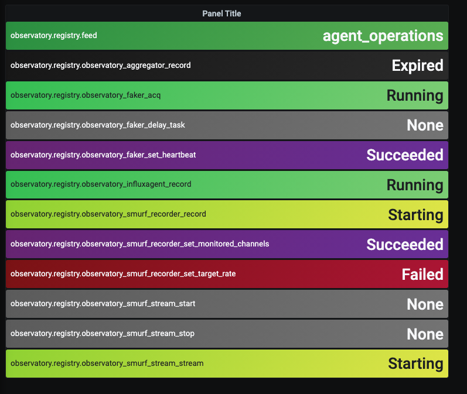

.. highlight:: rst

.. _registry:

==============
Registry Agent
==============

The Registry Agent tracks all currently running Agents on the OCS network,
providing the ability to monitor the status of each Agent's Tasks and Processes
through the :ref:`operation_monitor`.

Configuration File Examples
----------------------------

Below are configuration examples for the ocs config file and for running the
Agent in a docker container.

OCS Site Config
```````````````

An example site-config-file block::

    { 'agent-class': 'RegistryAgent',
      'instance-id': 'registry',
      'arguments': []},

Docker Compose
``````````````

An example docker-compose configuration::

    ocs-registry:
        image: simonsobs/ocs-registry-agent:latest
        container_name: ocs-registry
        hostname: ocs-docker
        user: "9000"
        volumes:
            - ${OCS_CONFIG_DIR}:/config

Description
-----------

The registry agent is used to keep track of currently running active agents.
It listens to the heartbeat feeds of all agents on the crossbar server, 
and keeps track of the last heartbeat time of each agent and whether 
or not each agent has agent has "expired" (gone 5 seconds without a heartbeat).

This check happens in the registry's single "main" process. The session.data
object of this process is set to a dict of agents on the system, including
their last heartbeat time, whether they have expired, the time at which they
expired, and a dictionary of their operation codes.  This data can the be
viewed by checking the session variable of the main process.

For instance, the following code will print agent's that have been on the system
since the registry started running::

    from ocs.matched_client import MatchedClient

    registry_client = MatchedClient('registry')
    status, msg, session = registry_client.main.status()

    print(session['data'])

which will print a dictionary that might look like::

    {'observatory.aggregator':
        {'expired': False,
         'last_updated': 1583179794.5175,
         'time_expired': None,
         'op_codes': {'record': 3}},
     'observatory.faker1':
        {'expired': False,
         'last_updated': 1583179795.072248,
         'time_expired': None,
         'op_codes': {'acq': 3, 'set_heartbeat': 1, 'delay_task': 1}},
     'observatory.faker2':
        {'expired': True,
         'last_updated': 1583179777.0211036,
         'time_expired': 1583179795.3862052,
         'op_codes': {'acq': 3, 'set_heartbeat': 1, 'delay_task': 1}}}

.. _operation_monitor:

Operation Monitor
`````````````````

The registry is also used to track the status of each agent's tasks and
processes. `Operation codes` for each operation are regularly passed through an
agent's heartbeat feed, which the registry assembles and publishes through its
own OCS feed. This makes it possible to monitor individual operation states in
grafana and to easily set alerts when a process stops running or when a task
fails.

By mapping the enumeration values described in the ``OpCode`` documentation in
the :ref:`ocs_base api <ocs_base_api>`, one can make a grafana panel to monitor
all operations on a network as pictured below:




Agent API
---------

.. autoclass:: agents.registry.registry.Registry
    :members:

Supporting APIs
---------------
.. autoclass:: agents.registry.registry.RegisteredAgent
    :members:

