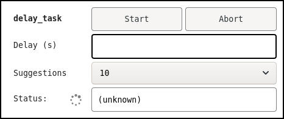

.. highlight:: javascript

.. _wev:

Web
===

Overview
--------

This section describes the structure of the OCS Web system, accessed
through ``monitor.html``.  The OCS Web system runs entirely in the web
browser, and communciates with the OCS websocket interface (the
crossbar server) using `autobahn.js`_.

The important source files in this system are:

``monitor.html``
    The main HTML entry point for the page.

``monitor.css``
    The style sheet.

``monitor.js``
    The main javascript source file, where the initialization function
    lives.

``js/monitor_ui.js``
    TabManager and OcsUiHelper classes.

``js/ocsbow.js``
    OCSConnection and AgentClient classes.  Also some general utility
    functions.


In addition to those main components, a few other files provide
Agent-specific control panels (let's call them **Agent Panels**).  For
Agents included in the main OCS distribution (rather than in SOCS),
these files live in the ``js/`` directory.  The are:

- ``FakeData.js``: Panel for the FakeDataAgent.
- ``Aggregator.js``: Panel for the AggregatorAgent.
- ``generic_panel.js``: Generic panel to permit limited control of any
  Agent.


Development Environment
-----------------------

Assuming you have a working OCS and web monitor running, some minor
changes to the configuration might be needed in order to facilitate
creation or modification of an Agent Panel.

Whatever mechanism that you are using to serve the OCS web files, we
will need to serve a new javascript file through that system; we will
also need to change ``monitor.html`` to refer to that javascript file.

Two options are described below: local hosting, and docker volume
mounting.  Figure out which is easier and do that.


Local hosting
`````````````

The simplest option is to simply host the web monitor files on your
local system, i.e. on the same system where your web browser is
running.  You can simply check out the ``ocs`` repository and then
open the file www/monitor.html in your web browser (most browsers
allow you to open files on your local file system).

To get the web page to connect to your OCS installation, you will need
to enter the right crossbar address into the "WAMP url" in the
"Connection" box.  If you are not on the same network as the OCS
installation, you should set up an ssh tunnel.  The tunnel command
will look something like:

.. code-block:: bash

  ssh -L 8001:localhost:8001 user@example.com -N

The port number on the left should be left at 8001, because that's the
default assumed by ``monitor.html``.  The remote-side part of the
address, "localhost:8001", might need to be changed.  Put in the host
and port where a user would find crossbar, after logging in to
example.com.  Tunneling like this works on Linux, OS X, and Windows
Subsystem for Linux.  The -N at the end just prevents a remote shell
from running; instead, this command will hang, and when you Ctrl-C out
of it the tunnel will be closed.

Docker Volume Mounting
``````````````````````

If you prefer to keep working with a docker container and web server
that are already set up, you will just need to mount some files into
the container.

Suppose you'll be working in ``/home/you/ocs/www``, and
``monitor.html`` is there, and you're going to put your new Agent
Panel code there too.  Add these volumes to your docker-compose entry
for the ocs-web container:

.. code-block:: yaml

   volumes:
     - /home/you/ocs/www/monitor.html:/var/www/html/monitor.html:ro
     - /home/you/ocs/www/js/VacuumCleaner.js:/var/www/html/js/VacuumCleaner.js:ro

Then restart the container.  Note that ``VacuumCleaner.js`` is a
stand-in for your Agent Panel javscript filename, which you will be
told the name of, later.


Creating a New Agent Panel
--------------------------

**The next few sections describe how to set up a new Agent panel, by
copying and modifying the panel for FakeDataAgent.  This constitutes
more of a tutorial than a complete description of the system.**

When you open ``monitor.html`` in a web browser, the "Agents" box
should auto-populate with the instances on your OCS network, and you
should be able to launch control panels for them.  In cases where
there is no custom panel type (such as the Agent you're working on
now), you'll get a modal dialog box to select "the agent class
appropriate for use with <instance-id>".

The first thing we will do is create a new script and have it
associated with your target Agent Class.  We will pretend your device
is a VacuumCleaner and your Agent code describes itself with
``agent_class='VacuumCleanerAgent'``.  Make appropriate substitutions!

1. Copy an existing Agent panel javascript file
   (e.g. ``js/FakeData.js``), giving it a name that matches the agent
   class.  Keep it in the ``js/`` directory.  So our file will be
   called ``js/VacuumCleaner.js``.

2. Open ``js/VacuumCleaner.js`` and make the following modifications:

   a) On line 1 there will be a comment block, perhaps just::

        /* FakeDataAgent UI */

      Change that to::

        /* VacuumCleanerAgent UI */

      You can add more text if you want.

   b) After this initial comment you should find a function called
      ``FakeData_populate``.  Change the function name so it's
      specific to your agent, e.g. ``VacuumCleaner_populate``.
      I.e. change::

        function FakeData_populate(p, base_id, args) {

      to::

        function VacuumCleaner_populate(p, base_id, args) {
        

   c) At the very bottom of the file, change how the populate function
      is registered.  Change the line::

        tabman.constructors['FakeDataAgent'] = FakeData_populate;

      to::

        tabman.constructors['VacuumCleanerAgent'] = VacuumCleaner_populate;

      Remember that in javascript, indentation often isn't important
      but semicolons often are important.  Note that the string on the
      left here is the only time where we actually *need* to match the
      string stated in the Agent python code.  This string will be
      compared against the class_name reported by the Agent through
      OCS.

3. Open ``monitor.html`` in an editor and find the line that says:

   .. code-block:: html

         <!-- ADDITIONAL OCS UI IMPORTS GO HERE. -->

   Right above that line, add a line that says:

   .. code-block:: html

       <script src="js/VacuumCleaner.js"></script>

   Make sure you change ``VacuumCleaner`` to your target Agent class
   name.


Having made those changes, you should trigger a reload of monitor.html
in your browser.  Now, when you click to launch a tab for the target
Agent, it should automatically open the tab, without querying the
agent type.  If it doesn't, then one or more of the following could be
true:

- Your changes did not take effect -- are you editing the right files?
  Use "view source" in the browser to confirm your changes are there.
- Your changes had javascript errors, preventing correct code
  execution.  To debug javascript errors, open the developer interface
  (e.g. by pressing F12 in Firefox).
- The name you put into tabman.constructors is not the same as the
  agent class name reported by the agent.  In this case, check in the
  Agent selection dialog to see if VacuumCleanerAgent is listed.  If
  so, the problem may be that your Agent (python code) is not
  reporting an agent class, or is reporting a different agent class.


Organizing the Panel
--------------------

Controls in a Panel are in a hierarchical structure that breaks down
like this:

- The Panel consists of an HTML ``<div>`` with class ``block_holder``.
  One or more ``<div>`` elements with class ``block_unit`` are added
  to it.
- To each ``block_unit``, any number of UI Boxes may be added.  The UI
  Boxes are constructed using the OcsUiHelper class, and can include
  any number of controls and indicators.
- Individual controls or indicators (such as a labeled input box or a
  progress bar) occupy 1 (or possibly more) rows of a UI box.


The ``block_unit`` divs will flow around each other, when the browser
window is resized, to support wide screens (monitors) and narrow
screens (phones).  It probably makes sense to allocate your controls
into two divs, with each div spanning roughly the same vertical
extent.

The UI controls are set up programmatically, with the OcsUiHelper,
which wraps jquery calls.  This is described in the next section.  The
handling of operation status information (to update indicators), and
the construction of parameter bundles for passing to OCS operations
when "start" is clicked are described in the section after that.


UI Box construction
-------------------

The HTML for a "UI Box" is created by the OcsUiHelper class.  For
example, controls that look like this:



are created by this javascript::

    var ui1 = new OcsUiHelper(base_id);
    ui1.dest($('#' + base_id + '-controls'))

        .task('delay_task')
        .op_header()
        .text_input('delay', 'Delay (s)')
        .dropdown('delay_box', 'Suggestions', ['10', '100', '1000'])
	.status_indicator()

    ;

Here is what each line does:

- ``var ui1 = ...``: This creates a new UI Box.  The "base_id" is
  passed in to the VacuumCleaner_populate function, and is some string
  (e.g. "ocs1000002") that is unique to this panel instance and is
  used to generate ids for each UI element.
- ``ui1.dest($('#' + base_id + '-controls'))``: This tells the
  OcsUiHelper to generate HTML elements in the ``div`` with id
  ``base_id + '-controls'``.  This is one of the ``block_unit`` divs
  created at the top of the function.  Note that this statement
  doesn't end with a semi-colon; this line and the next five lines use
  method chaining.  Each function call returns ``ui1``, so
  ``ui1.method1().method2()``; is equivalent to ``ui1.method1();
  ui1.method2();``).
- ``.task('delay_task')``: This starts the construction of a UI
  element for an OCS task; see the description of set_context.
- ``.op_header()``: This generates the first line of the UI, with the
  name of the operation and two buttons to start and stop/abort it.
- ``.text_input('delay', 'Delay (s)')``: This creates a text input
  box.  The second argument is the label, shown in the panel.  The
  first argument is the internal id for this element, and will be
  needed later to access the value stored in the box when the user
  clicks the Start button.
- ``.dropdown(...)``: This creates the drop-down box labeled
  "Suggestions".  Note the id in this case is ``delay_box``.
- ``.status_indicator()``: This creates the status indicator.  This
  indicator type is specifically designed for showing OCS Operation
  status information.


Bundling parameters for start()
-------------------------------

When the Start button is clicked, the following things happen,
internally:

- Data from the input elements associated with the operation are
  automatically collected and placed into an object.  In the example
  above, the object would have fields called ``delay`` and
  ``delay_box``.
- These data are passed to a callback function defined by the user.


By default, a generic callback function is used that will simply pass
all the input element data to the operation's start call.  This is
probably only good enough for *very* simple operations, that take zero
or so parameters.  (There is a default handler for stop/abort as well,
but that is more broadly useful since those methods never take
parameters.)

It's likely you'll need to process your input parameters for Start,
which thus requires setting up a customized callback function that
processes and validates input.  The callback function is provided to
the method ``OcsUiHelper.on(op_name, action, callback)``.  In the
FakeData example, this is done like this (with some annotation
added)::


    // the 'delay_task'.
    ui1.on('delay_task', 'start',
      function(data) {
        // The variable params is what we'll actually pass to the Agent.
        var params = {};

        // Attempt to convert delay and delay_box values to Floats.
        // If those entries are null, they will be converted to NaN.
        data.delay = parseFloat(data.delay);
        data.delay_box = parseFloat(data.delay_box);

        // If data.delay is a valid float, use it as the delay
        // argument.  If it is not, try the same with delay_box.
        if (!isNaN(data.delay))
            params.delay = data.delay;
        else if (!isNaN(data.delay_box))
            params.delay = data.delay_box;

        // Do a final check that we're not requesting a negative delay...
        // then call the 'start' method on task 'delay_task', with
        // the parameters in params.  Depending on the inputs, params
        // will contain just a 'delay' entry with float value, or
        // it might be empty (in which case the task should use the
        // default 'delay' parameter).

        if (params.delay && params.delay < 0)
            alert("Can't send negative delay value!");
        else
            client.start_task('delay_task', params);
      }
    );


Updating indicators
-------------------

Status information from each Operation can be monitored and used to
update indicators in the UI Boxes.  This is done by requesting that
the ``client`` call a callback function whenever it gets new operation
status information.  The method to assign this callback is described here:

    ``AgentClient.add_watcher(op_name, span, handler)``
        Registers the function ``handler`` to be called whenever the
        operation ``op_name`` session data is updated.  The operation
        will be polled at interval ``span``, in seconds.  The
        signature of handler must be ``function(op_name, method_name,
        exit_code, message, session)``.

In FakeDataAgent, the handler is associated to the ``delay_task``,
like this::

    client.add_watcher('delay_task', 1., function(op_name, method, stat, msg, session) {
        // Use the special "set_status" call to populate the operation status.
        ui1.set_status('delay_task', session);

        // If there is no session data, stop processing.
        if (!session.data)
            return;

        // Grab some values from session.data: "delay_so_far" and "requested_delay".
        var so_far = session.data.delay_so_far;
        var reqd = session.data.requested_delay;

        // Make sure that the values are defined... then write them
        // into the indicators called 'delay_reqd' and 'delay_so_far' in ui2.
        if (reqd)
            ui2.get('v', 'delay_reqd').val(reqd.toFixed(3));
        if (so_far)
            ui2.get('v', 'delay_so_far').val(so_far.toFixed(3));

        // If reqd and so_far are both present, use them to update the progressbar.
        if (reqd && so_far)
            ui2.get('v', 'delay_progress').progressbar({value: 100 * so_far / reqd});
    });


OcsUiHelper Method Reference
----------------------------

Passive and Formatting Methods
``````````````````````````````

*Passive elements are intended to show static content, in contrast to
input or indicator elements.  Formatting methods affect display
features (such as borders).*

    banner(label_text)
        This a large font text banner, spanning the entire width of
        the parent block_unit div.


Contextual Methods
``````````````````

*Contextual methods change the internal state of the OcsUiHelper, such
that subsequent input or indicator elements will be grouped together.*

    set_context(op_name, op_type)
        Sets the internal context (op_name, op_type).  The internal
        context is used for two things.  First, some methods (such as
        ``op_header()``) behave slightly differently depending on
        ``op_type`` (see ``task()`` and ``process()`` below).  Second,
        the ``op_name`` is used to construct unique ids for any input
        or indicator elements.  Any input or indicator elements
        declared after this, but before the next context-setting
        method is called, will be associated with this op_name.  When
        retrieving an element using ``get``, an ``op_name`` and
        ``id`` must both be passed in.

    process(op_name)
        Equivalent to ``set_context(op_name, 'process')``.

    task(op_name, op_type)
        Equivalent to ``set_context(op_name, 'task')``.


Input Elements
``````````````

Input elements have an ``id`` argument.  This will be used to populate
an Object with the input values.

    op_header()
        This creates a header for an Operation, stating the name of
        the Operation in bold, along with two buttons to Start and
        Stop/Abort the Op.  (This would typically be preceded by a
        call to ``task(op_name)`` or ``operation(op_name)``.)

    text_input(id, label_text)
        This creates a text box input.

    dropdown(id, label_text, options)
        This creates a dropdown box.  The options can an Array or an
        Object.  For example, ['a', 'b', 'c'].  If you want to display
        different strings to the user than are used internally, use an
        Object to map the internal values to display strings; for
        example ``{'a': 'Use an A', 'b': 'Use a B', 'c': 'Use a C'}``.


Indicator Elements
``````````````````

    text_indicator: function(_id, label_text, opts)
        This is the most basic indicator.  opts should be an Object
        (or null).  The following elements of opts are recognized:

        - ``.center``: If true, the text in the indicator is centered.

    status_indicator()
        Creates a special indicator, similar to text_indicator, for
        displaying Operation Status information (for example, it
        checks the run state of the sesssion and presents the time
        elapsed since last state change).  This doesn't take an ``id``
        argument... 'status' will be used.

    progressbar(id, label_text)
        Creates a progress bar.  To update this bar, call, for
        example: ``ui.get(op_name, id).progressbar({value: 95})``.

    indicator(id)
        This creates a full-width div that can be used for whatever.

    canvas(id)
        This creates a full-width canvas element that can be used for
        whatever.


Input Processing
````````````````

    get(op_name, id)
        Returns the element associated with the specified ``op_name``
        and ``id``.  For simple inputs (such as text_input or
        dropdown), you can extract the input data by calling
        ``.val()`` on the returned result.

Indicator Update
````````````````

*Note that for simple items created by ``text_indicator()``, you can
use ``.get(op_name, id).val(text)`` to update the text in the
indicator.*

    set_status(op_name, session)
        Special function to populate the indicator created with
        ``status_indicator()``.  The ``session`` argument is of the
        kind returned by OCS Agent API calls.

    set_connection_status(op_name, id, ok, opts)
        Special function to populate a ``text_indicator`` with an
        Agent's connection status information.  It's possible to have
        controls become disabled when the Agent connection fails; see
        code in monitor_ui.js and example usage in the FakeData panel.


.. _`autobahn.js`: https://crossbar.io/autobahn/
