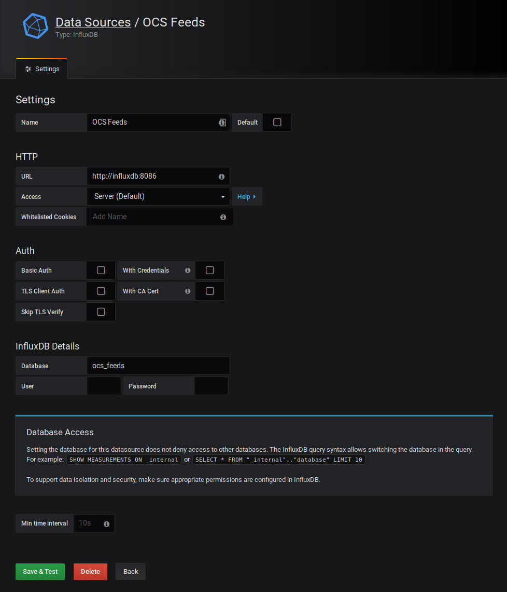
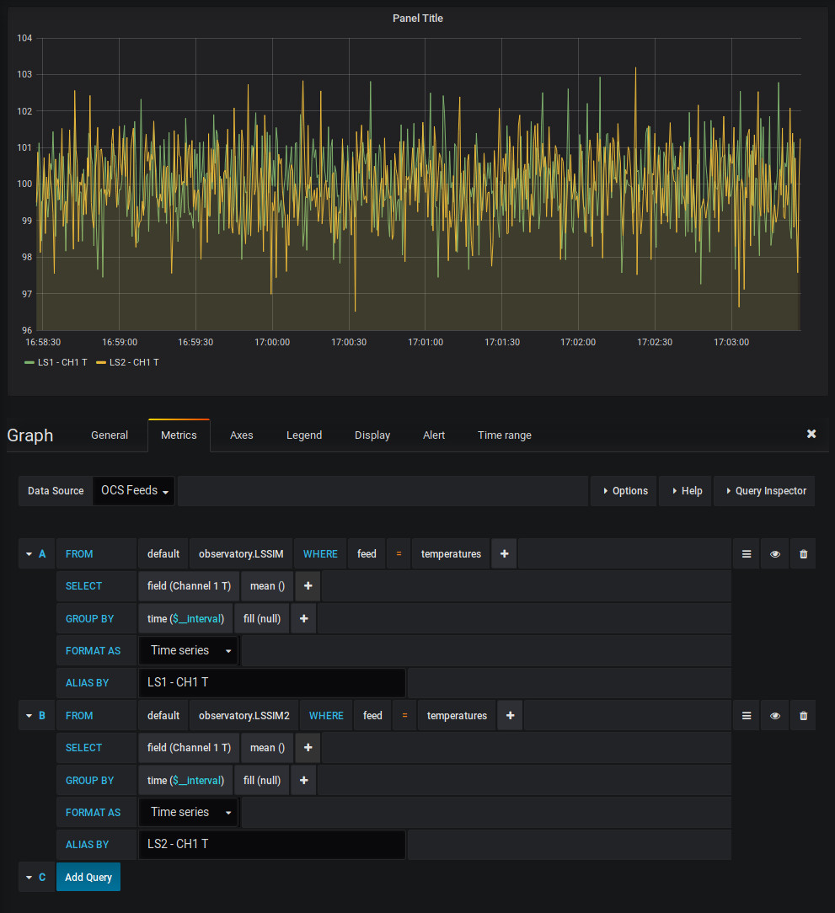

.. highlight:: rst

.. _influxdb_publisher:

========================
InfluxDB Publisher Agent
========================

The InfluxDB Publisher Agent acts like the OCS Aggregator, but instead of
writing to file it will publish all recorded OCS data feeds to an InfluxDB
instance running somewhere on the network.

OCS Configuration
-----------------
Add an InfluxDBAgent to your OCS configuration file::

      {'agent-class': 'InfluxDBAgent',
       'instance-id': 'influxagent',
       'arguments': [['--initial-state', 'record'],
                     ['--host', 'influxdb'],
                     ['--port', 8086]]},

docker-compose Configuration
----------------------------
Add the InfluxDB Publisher Agent container to your docker-compose file::

  ocs-influxdb-publisher:
    image: simonsobs/ocs-influxdb-publisher-agent
    hostname: ocs-docker
    volumes:
      - ${OCS_CONFIG_DIR}:/config:ro

You will also need an instance of InfluxDB running somewhere on your network.
This likely should go in a separate docker-compose file so that it remains
online at all times.

::

  influxdb:
    image: "influxdb:1.7"
    container_name: "influxdb"
    restart: always
    ports:
      - "8086:8086"
    volumes:
      - /srv/influxdb:/var/lib/influxdb

  networks:
    default:
      external:
        name: ocs-net

.. note::
    This separate docker-compose file setup depends on having a docker network
    that connects your various docker-compose files. On a single-node setup
    this can be accomplished with the network settings above in each docker-compose
    file.

    You then need to create the docker network with::

       $ docker network create --driver bridge ocs-net

    Containers on the network should then be able to communicate.

Grafana Configuration
---------------------
Once your InfluxDB container and publisher are configured and running you will
need to create an InfluxDB data source in Grafana. To do so, we add an InfluxDB
data source with the URL ``http://influxdb:8086``, and the Database
"ocs_feeds". The Name of the Data Source is up to you, in this example we set
it to "OCS Feeds".

In a dashboard, create a new panel. Each panel can have a different Data
Source, which is selected at the top of the Metrics tab. Select our "OCS Feeds"
data source. You'll then see the rich query editor for your InfluxDB data
source. Each OCS Agent shows up as a "measurement" (here "observatory.LSSIM"
and "observatory.LSSIM2"). Each feed published by an agent is an InfluxDB tag
(here "temperatures" is our only feed.) Finally, each field is available within
the SELECT query.

For more information about using InfluxDB in Grafana, see the `Grafana Documentation`_.

.. _`Grafana Documentation`: https://grafana.com/docs/features/datasources/influxdb/
