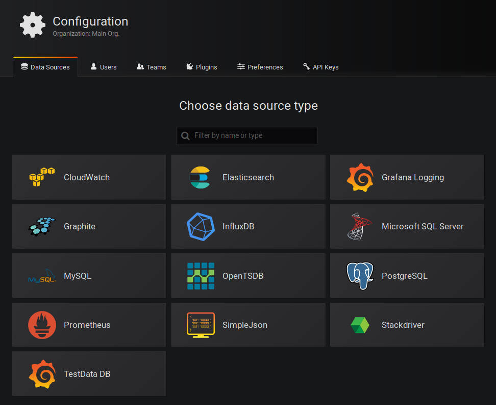
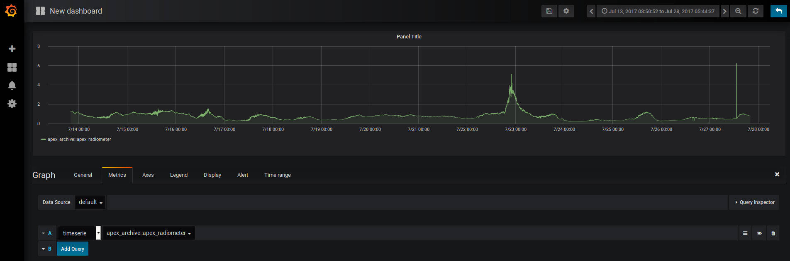

.. highlight:: rst

Using Grafana
=============

Our environment is configured, OCS Agents are running, and we have commanded
them to acquire some data. We are now ready to configure Grafana_. The
configuration is not challenging, however dashboard configuration can be time
consuming. We start with the first time setup steps.

.. _Grafana: https://grafana.com/

Set a Password
--------------

When you first navigate to http://localhost:3000 in your web browser you will see
the following page:

.. image:: img/live_monitoring/grafana_01.jpg

The default username/password are `admin`/`admin`. Once you enter this it
will prompt you to set a new admin password. Select something secure,
especially if your computer has a public IP address.

.. note::
    Grafana can be a great way to check the housekeeping data at your site from
    anywhere you can access a web browser. For a more user friendly and secure
    connection you should setup a web server to proxy the connection to the Grafana
    container. This, however, is currently beyond the scope of this guide.

Configuring the Data Source
---------------------------

After setting the password you will end up on this page:

.. image:: img/live_monitoring/grafana_02.jpg

Click on the highlighted "Add data source" icon. (This is also accessible under
the gear in the side menu as "Data Sources".) You should then see this:

These are all the supported sources from which Grafana can pull data. We will
use the SimpleJson source. Clicking on that icon will get you here:

.. image:: img/live_monitoring/simple_json_config.jpg

You can fill in what you want for a name, or keep the default. Make sure the
"Default" checkbox is checked, as this will be our default data source when
creating a new Dashboard. Finally, the URL must be ``http://sisock-http:5000``.
This is the name for the HTTP server we set in the ``docker-compose.yml`` file
with the default port we assigned it.

When you click "Save & Test" a green alert box should show up, saying "Data
source is working", like this:

.. image:: img/live_monitoring/grafana_05.jpg

If the Data Source is not working you will see an HTTP Error Bad Gateway in red:

.. image:: img/live_monitoring/grafana_06.jpg

If this occurs it could be several things.

* Check the URL is correct
* Make sure you select the SimpleJson data source Type
* Check the sisock-http container is running

Configuring a Dashboard
-----------------------

Now that we have configured the Data Source we can create our first Dashboard.
If you press back on the previous screen you will end up on the Data Sources
menu. From any page you should have access to the sidebar on the left hand side
of your browser. You may need to move your mouse near the edge of the screen to
have it show up. Scroll over the top '+' sign and select "Create Dashboard", as
shown here:

.. image:: img/live_monitoring/grafana_07.jpg

You will then see a menu like this:

.. image:: img/live_monitoring/grafana_08.jpg

In this menu we are selecting what type of Panel to add to our Dashboard. We
will add a Graph. When we first add the Graph it will be blank:

.. image:: img/live_monitoring/grafana_09.jpg

Click on the "Panel Title", and in the drop down menu, click "Edit". This will
expand the plot to the full width of the page and present a set of tabbed menus
below it.

.. image:: img/live_monitoring/grafana_10.jpg

We start on the "Metrics" tab. Here is where we add the fields we
wish to plot. The drop down menu that says "select metric" will contain fields
populated by the sisock data servers. Select an item in this list, for
instructional purposes we will select the "apexl_archive::apex_radiometer"
metric, which is from an example data server which contains a small sample of
data to verify the live monitor is working properly. Data should appear in
the plot if you are running the example weather data server container and have
selected the date range between July 13, 2017 and July 28, 2017.

You can configure the time interval and update intervals by clicking on the
time in the upper right, it most likely by default says "Last 6 hours":

.. image:: img/live_monitoring/grafana_12.jpg

.. note::
    The update intervals can be further customized by editing the dashboard.
    This can be done by clicking on the gear icon near the time settings. Keep in
    mind though that the more data you load the less you want to be rapidly
    querying the backend for displaying it. Performance may be impacted if you
    query large datasets rapidly.

Viewing the Live Monitor
------------------------

Now we should start to see data in our live monitor.

.. warning::
    If no data is showing up, you may have to select the metrics drop down menu
    again when first starting up.  This is a known bug. Selecting the metric drop
    down should get data showing again. This is likely only a problem after you
    have a configured panel and restart the live monitor containers.

Here are some examples of what fully configured panels may look like:

.. figure:: img/live_monitoring/grafana_13.jpg

    The diode calibration setup at Penn. Six diodes are readout on a single
    Lakeshore 240. The top plot shows the calibrated diode, reporting temperature
    in Kelvin. While the bottom plot shows the 5 uncalibrated diodes.  The Top
    element is a SingleStat panel which shows the current temperature of the 4K
    plate via the calibrated diode.

.. figure:: img/live_monitoring/grafana_14.jpg

    A demo Lakeshore 372 readout at Yale. The Lakeshore switches over 15
    channels, reading each out for a few seconds before moving onto the next.
    Here the first eight channels are shown on the left plot, and the last
    seven shown on the right plot. There are 15 single stat panels below the
    plots showing the current values for each given channel.
