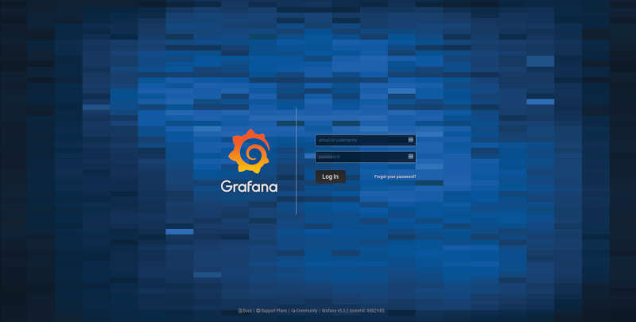
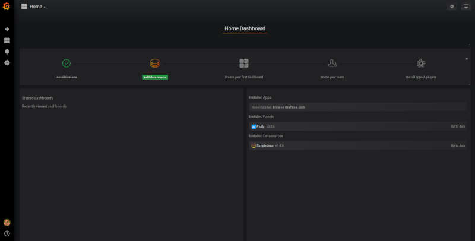
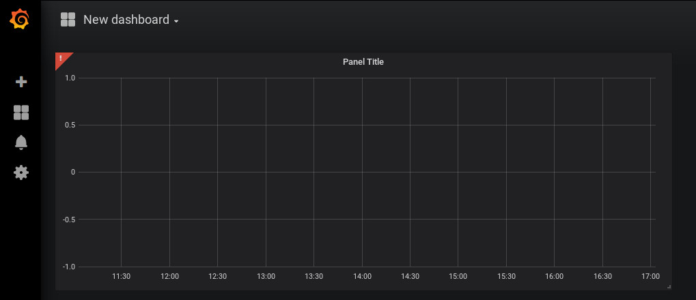
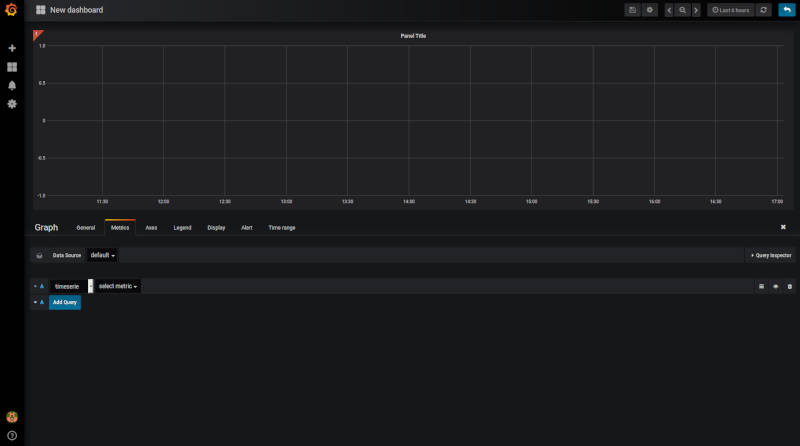

.. highlight:: rst

Using Grafana
=============

Now we are ready to configure Grafana_. The configuration is not challenging,
however dashboard configuration can be time consuming. The ``grafana-storage``
volume that we initialized will allow for persistent storage in the event the
container is rebuilt. Dashboards can also be backed up by exporting them to a
``.json`` file.

.. warning::
    This should be a one time setup, however, if you destroy the
    grafana-storage volume you will lose your configuration. We encourage you
    to export your favorite dashboards for backup.

Set a Password
--------------

When you first navigate to ``localhost:3000`` in your web browser you will see
the following page:

The default username/password are ``admin``/``admin``. Once you enter this it
will prompt you to set a new admin password. Select something secure if your
computer faces the internet. If it's local only you can keep the default,
however whenever you login it will prompt you to change the default.

Configuring the Data Source
---------------------------

After setting the password you will end up on this page:

Click on the highlighted "Add data source" icon. This is also accessible under
the gear in the side menu as "Data Sources". You should then see this:

.. image:: img/live_monitoring/grafana_03.jpg

Here we configure the source from which Grafana will get all our data, this is
going to be the ``sisock-http`` server we started up in Docker. You can
fill in what you want for a name, though I'd suggest "sisock". Make sure the
"Default" checkbox is checked, as this will be our default data source when
creating a new Dashboard. Type must be "SimpleJson" (we installed this as a
plugin when we started up the Docker container, this is not a default option
available in Grafana). And finally the URL must be ``http://sisock-http:5000``.
This is the name for the HTTP server we set in the ``docker-compose.yml`` file
as well as the port we assigned it. Now you should have something that looks
identical to this:

.. image:: img/live_monitoring/grafana_04.jpg

When you click "Save & Test" a green alert box should show up, saying "Data
source is working", like this:

.. image:: img/live_monitoring/grafana_05.jpg

If the Data Source is not working you will see an HTTP Error Bad Gateway in red:

.. image:: img/live_monitoring/grafana_06.jpg

If this occurs it could be several things.

* Check the URL is correct
* Make sure you select the SimpleJson data source Type
* Check the sisock-http container is running
* Check you have added the grafana container to the sisock-net

Configuring a Dashboard
-----------------------

Now that we have configured the Data Source we can create our first Dashboard.
If you press back on the previous screen you will end up on the Data Sources
menu. From any page you should have access to the sidebar on the left hand side
of your browser. You may need to move your mouse near the edge of the screen to
have it show up. Scroll over the top '+' sign and select "Create Dashboard", as
shown here:

.. image:: img/live_monitoring/grafana_07.jpg

You will then see a menu like this:

.. image:: img/live_monitoring/grafana_08.jpg

In this menu we are selecting what type of Panel to add to our Dashboard. We'll
add a Graph. When we first add the Graph it will be blank:

Click on the "Panel Title", and in the drop down menu, click "Edit". This will
expand the plot to the full width of the page and present a set of tabbed menus
below it.

We start on the "Metrics" tab. Here is where we add the fields we
wish to plot. The drop down menu that says "select metric" will contain fields
populated by the sisock ``DataNodeServers``. Select an item in this list, for
instructional purposes we'll select a sensors metric, which is from the demo
CPU temperature ``DataNodeServer``. Data should appear in the plot, assuming
you are also running the ``dans-example-sensors`` demo container (though a
similar test can be performed with the ``dans-example-weather`` demo
container.)

.. image:: img/live_monitoring/grafana_11.jpg

You can configure the time interval and update intervals by clicking on the
time in the upper right, it most likely by default says "Last 6 hours":

.. image:: img/live_monitoring/grafana_12.jpg

The thermometry ``DataNodeServers`` by default cache the last 60 minutes of
data. Loading older data from disk is currently a work in progress.

Viewing the Live Monitor
------------------------

Now we should start to see data in our live monitor.

.. note::
    If no data is showing up, you may have to select the metrics drop down menu
    again when first starting up.  This is a known bug. Selecting the metric drop
    down should get data showing again. This is likely only a problem after you
    have a configured panel and restart the ``DataNodeServer``.

Here are some examples of what fully configured panels may look like:

.. figure:: img/live_monitoring/grafana_13.jpg

    The diode calibration setup at Penn. Six diodes are readout on a single
    Lakeshore 240. The top plot shows the calibrated diode, reporting temperature
    in Kelvin. While the bottom plot shows the 5 uncalibrated diodes.

    The Top element is a SingleStat panel which shows the current temperature
    of the 4K plate via the calibrated diode.

.. figure:: img/live_monitoring/grafana_14.jpg

    A demo Lakeshore 372 readout at Yale. The Lakeshore switches over 15
    channels, reading each out for a few seconds before moving onto the next.

    Here the first eight channels are shown on the left plot, and the last
    seven shown on the right plot. There are 15 single stat panels below the
    plots showing the current values for each given channel.

.. _Grafana: https://grafana.com/
