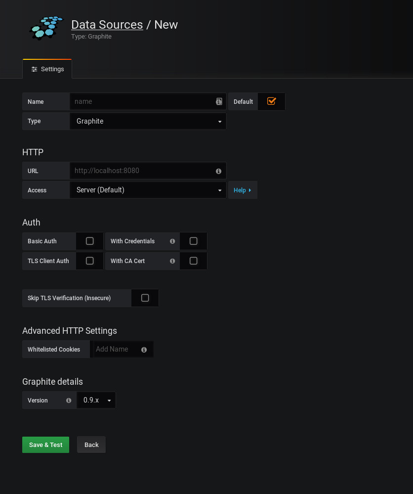
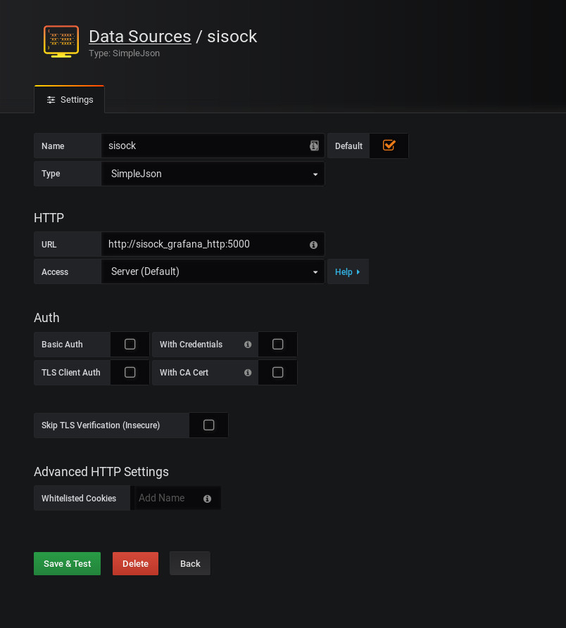
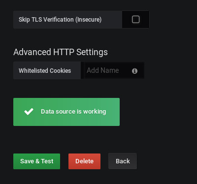
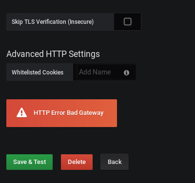
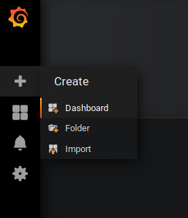
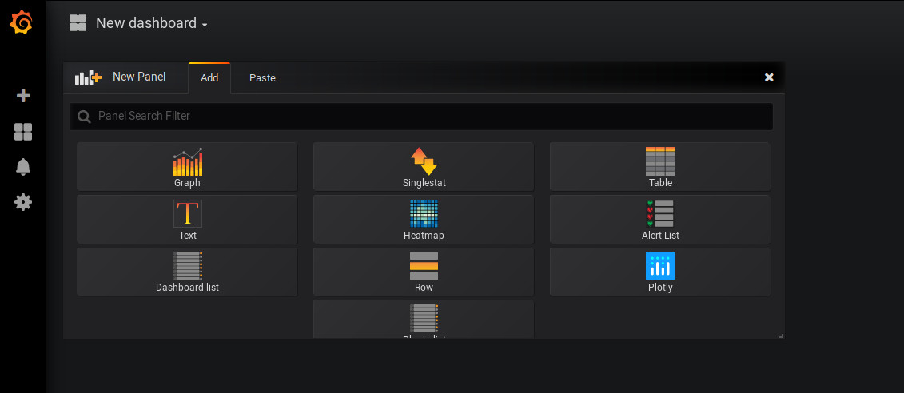
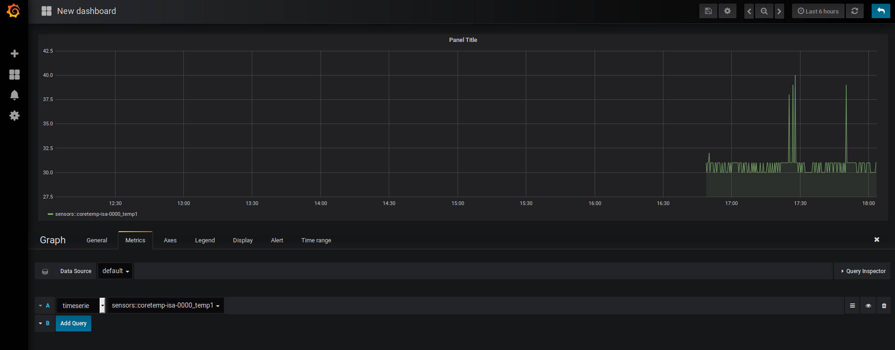
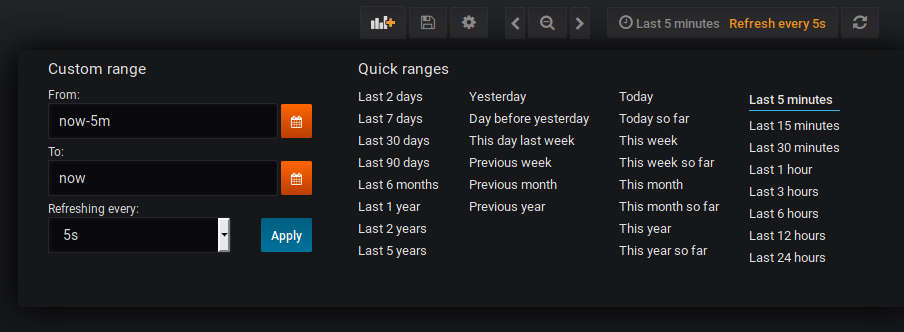
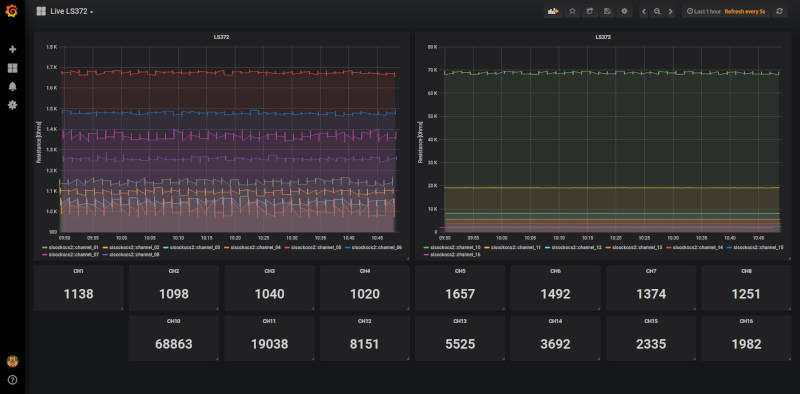

.. highlight:: rst

.. _live_monitoring:

====================
OCS Live Monitoring
====================

OCS allows one to command and control their equipment, but how do we monitor
that equipment?

For that we use a combination of sisock_ and a web application called Grafana_. 

.. contents::
    :backlinks: none

Dependencies
============

While there are mostly software dependencies for this, there is one hardware
requirement, you will need a linux machine with Ubuntu 18.04 installed. Other
Operating Systems can be used, but will not be supported.

    * OCS_
    * Docker_
    * `Docker Compose`_
    * sisock_ - For the live monitor.
    * spt3g_ - For writing data to disk in ``.3g`` format.

Networking Requirements
-----------------------

This linux machine will need to go on the same network as whatever hardware
you're controlling with OCS. Live monitoring remotely (i.e. not sitting
directly at the computer) is facilitated if your IT department allows it to
have a public IP address.

    If you do have a public IP and traffic is allowed to
    all ports, you are strongly recommended to enable a firewall as described in
    firewall_.

    If you do not have a public IP, but do have access to a gateway to
    your private network, then port forwarding can be used to view the live monitor
    remotely, as described in port_forwarding_.

.. _Installing OCS:

Installing OCS
==============

Install OCS with the following::

    $ git clone https://github.com/simonsobs/ocs.git
    $ cd ocs/
    $ pip3 install -r requirements.txt --user .

These directions are presented in the `OCS repo`_ and likely has the most up to
date version. If you need to update OCS, be sure to stash any changes you've
made before pulling updates from the repo.

.. _OCS site-config file:

Configure OCS site-config
=========================

Site configuration is described over on the page :ref:`site_config`. We will
look at the ``yale.yaml`` config as an example::

    hub:
    
      wamp_server: ws://localhost:8001/ws
      wamp_realm: test_realm
      address_root: observatory
    
    hosts:
    
      grumpy: {
    
        # Description of grumpy's Agents.  We have two readout devices;
        # they are both Lakeshore 372s.  But they can be distinguished, on
        # startup, by a device serial number.
    
        'agent-instances': [
          {'agent-class': 'Lakeshore372Agent',
           'instance-id': 'control',
           'arguments': [['--serial-number', 'LSA22YG'],
                         ['--ip-address', '172.16.127.192']]},
          {'agent-class': 'Lakeshore372Agent',
           'instance-id': 'measurement',
           'arguments': [['--serial-number', 'LSA22HA'],
                         ['--ip-address', '172.16.127.191']]},
          {'agent-class': 'Lakeshore240Agent',
           'instance-id': 'ls240',
           'arguments': [['--serial-number', 'LSA21OQ']]},
          {'agent-class': 'AgreggatorAgent',
           'instance-id': 'aggregator',
           'arguments': []},
        ]
      }


For testing institutions the ``wamp_realm`` is unlikely to change and should be
kept as the value ``test_realm``. Similarly, for now, with the
``address_root``. You will need to change ``grumpy`` to be the hostname of the
computer you are running OCS on.

Each item under a given host describes the OCS Agents which may be run. For
example we'll look at the first 372 Agent here::

          {'agent-class': 'Lakeshore372Agent',
           'instance-id': 'control',
           'arguments': [['--serial-number', 'LSA22YG'],
                         ['--ip-address', '172.16.127.192']]},

The ``agent-class`` is given by the actual Agent we'll be running. This must
match the name defined in the Agent's code. The ``instance-id`` is a unique
name given to this agent instance. This will need to be noted for later use in
the live monitoring. Finally the arguments are used to pass default arguments
to the Agent at startup.

If this is your first time setting up and OCS site-config you'll want to follow
the instructions in the site-config_ repo's ``README`` as well.

For more information see the :ref:`site_config` page in this documentation.


Setting Up sisock
=================

The sisock repo provides the infrastructure we'll need to perform live
monitoring. The code in this repo will ultimately run within several Docker
containers, so no installation on your system is required. However, there are
some one time setup steps and you will also need to install both Docker_ and
`Docker Compose`_.

To clone the repo::

    $ git clone https://github.com/simonsobs/sisock.git

Generate TLS keys for sisock
----------------------------

To generate the keys::

    $ openssl genrsa -out server_key.pem 2048
    $ chmod 600 server_key.pem

For the next step you'll be asked to fill out a bunch of info, you can leave
the default on everything except for "Common Name" (CN), this should be the
name of your server, for use in the lab it's fine that this is 'localhost', so
you should just use that. I'll ask you to set a passphrase, leave it blank.::

    $ openssl req -new -key server_key.pem -out server_csr.pem
    $ openssl x509 -req -days 365 -in server_csr.pem -signkey server_key.pem \
              -out server_cert.pem

This information is also located in the ``README`` within the sisock repo in
``sisock/components/hub/.crossbar/``.

Installing Docker
-----------------

Docker is used to run many of the components related to sisock, including the
crossbar server, so we'll need it installed on the computer we're running
everything on. To install, please follow the `Docker installation`_
documentation on their website.

The docker daemon requires root privileges. To avoid this you can add your user
to the ``docker`` group. This is explained in the `post installation`_ steps,
also in the Docker docs.

When complete, the docker daemon should be running, you can check this by
running ``systemctl status docker`` and looking for output similar to the
following::

    $ systemctl status docker
    ● docker.service - Docker Application Container Engine
       Loaded: loaded (/lib/systemd/system/docker.service; disabled; vendor preset: enabled)
       Active: active (running) since Tue 2018-10-30 10:57:48 EDT; 2 days ago
         Docs: https://docs.docker.com
     Main PID: 1472 (dockerd)

Installing Docker Compose
-------------------------

Docker Compose facilitates running multi-container applications, which we have.
This will allow us to automatically build and run many containers with a single
command, but first we must install it. For that, see the `Docker Compose`_
documentation.

When complete you should be able to run::

    $ docker-compose --version
    docker-compose version 1.22.0, build 1719ceb

Setup the Docker Environment
----------------------------

If this is your first time using Docker you need to do some first time setup,
which is detailed in the ``sisock`` repo, but which we will review here.

    Note: While there is a docker group you could add your user to, be aware
    that users in this group are ``root`` equivalent. If you do not want the
    security implications that come with this, run docker with sudo.

We will be building a network of Docker containers. To provide name resolution
for the containers within the network we must build our own user defined bridge
network. We can do so by running::

    $ docker network create --driver bridge sisock-net

The first container we will create will be one that we do not command with
Docker Compose. This is the Grafana container, the one which we will use to
view the live monitor. Since we will be configuring grafana and do not want to
lose any information if we remove the container we will setup persistent
storage using a Docker volume::

    $ docker volume create grafana-storage

Now we can create the Grafana container. This pulls down the latest copy of
the container and runs it::

    $ docker run -d -p 3000:3000 --name=sisock_grafana -v grafana-storage:/var/lib/grafana -e "GF_INSTALL_PLUGINS=grafana-simple-json-datasource, natel-plotly-panel" grafana/grafana

To explain the options a bit, the name we have given the container is
``sisock_grafana``, we have mounted the persistent storage docker volume to
``/var/lib/grafana`` within the container, we have installed several plugins,
and we have exposed the container on port 3000 of our machine.

Finally, we need to add the ``sisock_grafana`` to our custom defined network::

    $ docker network connect sisock-net sisock_grafana

Now we are nearly ready to run the remaining containers with Docker Compose,
but first we must configure the ``docker-compose.yaml`` file.

Configure ``docker-compose.yaml``
---------------------------------

sisock comes with a sensible ``docker-compose.yaml`` file, which looks something like this::

    version: '3'
    services:
      sisock:
        image: "sisock"
        build: .
      sisock_crossbar:
        image: "sisock_crossbar"
        container_name: sisock_crossbar
        build: ./components/hub/
        ports:
         - "8080:8080"
         - "8001:8001"
        environment:
             - PYTHONUNBUFFERED=1
        depends_on:
          - "sisock"
      sisock_grafana_http:
        image: "sisock_grafana_http"
        container_name: sisock_grafana_http
        build: ./components/grafana_server/
        ports:
         - "5000:5000"
        depends_on:
          - "sisock_crossbar"
      sensors_server:
        image: "sensors_server"
        container_name: sensors_server
        build: ./components/data_node_servers/sensors/
        depends_on:
          - "sisock_crossbar"
          - "sisock_grafana_http"
      ls372_measurement:
        image: "ls372_measurement"
        container_name: ls372_measurement
        build: ./components/data_node_servers/thermometry/
        environment:
            TARGET: measurement # match to instance-id of agent to monitor, used for data feed subscription
            NAME: 'LSA22HA' # will appear in sisock a front of field name
            DESCRIPTION: "LS372 measuring test board in the lab."
        depends_on:
          - "sisock_crossbar"
          - "sisock_grafana_http"
      ls372_control:
        image: "ls372_control"
        container_name: ls372_control
        build: ./components/data_node_servers/thermometry/
        environment:
            TARGET: control # match to instance-id of agent to monitor, used for data feed subscription
            NAME: 'LSA22YG' # will appear in sisock a front of field name
            DESCRIPTION: "LS372 simulating control unit in the lab."
        depends_on:
          - "sisock_crossbar"
          - "sisock_grafana_http"
      ls240_monitor:
        image: "ls240_monitor"
        container_name: ls240_monitor
        build: ./components/data_node_servers/thermometry/
        environment:
            TARGET: ls240 # match to instance-id of agent to monitor, used for data feed subscription
            NAME: 'LSA21OQ' # will appear in sisock a front of field name
            DESCRIPTION: "LS240 unit in the lab."
        depends_on:
          - "sisock_crossbar"
          - "sisock_grafana_http"
    
    networks:
      default:
        external:
          name: sisock-net

Each service represent a different container which we will be building and
running, let's look at them one at a time::

      sisock:
        image: "sisock"
        build: .

This is the sisock container, it forms the base container for the crossbar
server container. It is based on the standard python container and simply
installs the sisock package.::

      sisock_crossbar:
        image: "sisock_crossbar"
        container_name: sisock_crossbar
        build: ./components/hub/
        ports:
         - "8080:8080"
         - "8001:8001"
        environment:
             - PYTHONUNBUFFERED=1
        depends_on:
          - "sisock"

This is the crossbar server, we have called in ``sisock_crossbar``. Do not
change this container name, as it is coded within the sisock programs as the
domain name for use in accessing the crossbar server. It exposes on both ports
8001 and 8080. Port 8080 is used for the secure connection to the crossbar
server, while port 8001 is unsecured. The build path shows where the
container's ``Dockerfile`` lives. You can view that for more details about the
container.::

      sisock_grafana_http:
        image: "sisock_grafana_http"
        container_name: sisock_grafana_http
        build: ./components/grafana_server/
        ports:
         - "5000:5000"
        depends_on:
          - "sisock_crossbar"

This is the container which forms the glue layer between sisock and grafana,
allowing us to view live data. The name of this container,
``sisock_grafana_http``, will become important once we are configuring the
grafana interface, as will the exposed port, 5000.::

      sensors_server:
        image: "sensors_server"
        container_name: sensors_server
        build: ./components/data_node_servers/sensors/
        depends_on:
          - "sisock_crossbar"
          - "sisock_grafana_http"

The sensors server is a demo sisock ``DataNodeServer`` which displays the CPU
temperatures of your computer. You can leave or remove this container from the
list. Similarly there is a demo weather server, which serves archived APEX
weather data. These demos can be used to confirm your system is running
properly, but are not needed for live monitoring.

The remaining containers are for ``DataNodeServers`` which interface with
various thermometry readout components, either Lakeshore 372's or a Lakeshore
240. We will look at one of the Lakeshore 372 examples::

      ls372_measurement:
        image: "ls372_measurement"
        container_name: ls372_measurement
        build: ./components/data_node_servers/thermometry/
        environment:
            TARGET: measurement # match to instance-id of agent to monitor, used for data feed subscription
            NAME: 'LSA22HA' # will appear in sisock a front of field name
            DESCRIPTION: "LS372 measuring test board in the lab."
        depends_on:
          - "sisock_crossbar"
          - "sisock_grafana_http"

The name we've given this container, ``ls372_measurement``, just needs to be
unique among the containers, you can change it to whatever you would like,
however, please change it in all three locations in this configuration.

The ``environment`` sets up environment variables, which will be passed to the
container. These in turn are used in the thermometry ``DataNodeServer``. The
``TARGET`` variable must match the OCS ``instance-id`` of the agent we want to
monitor, as this is used to select which data feed to subscribe to in OCS. The
``NAME`` variable gives the ``DataNodeServer`` its name, which is used in
constructing the fields which will be shown in the grafana interface for
selection of the data when plotting. Here I have used the serial number of the
Lakeshore 372. You can do something similar, I would just suggest making it
unique among your hardware.::

    networks:
      default:
        external:
          name: sisock-net

This final piece just tells ``docker-compose`` about our externally defined
network.

Run sisock Containers
---------------------

The final step, once Docker and Docker Compose have been installed and properly
configured, is to build and startup the containers. You can do so with::

    $ docker-compose up -d

The ``-d`` flag daemonizes the containers. If you remove it the output from
every container will be attached to your terminal. This can be useful for
debugging.

You can confirm the running state of the containers with the ``docker ps``
command::

    $ bjk49@grumpy:~$ docker ps
    CONTAINER ID        IMAGE                 COMMAND                  CREATED             STATUS              PORTS                                            NAMES
    740d8b57dfbb        ls240_monitor         "python3 thermometry…"   21 hours ago        Up 21 hours         8080/tcp                                         ls240_monitor
    4a1de5f81620        ls372_control         "python3 thermometry…"   2 days ago          Up 2 days           8080/tcp                                         ls372_control
    23806dbb0737        ls372_measurement     "python3 thermometry…"   2 days ago          Up 2 days           8080/tcp                                         ls372_measurement
    eb769aaf450c        sensors_server        "python3 -u server_e…"   2 days ago          Up 2 days           8080/tcp                                         sensors_server
    95d60cf05b69        weather_server        "python3 -u server_e…"   2 days ago          Up 2 days           8080/tcp                                         weather_server
    ae38b25f52d4        sisock_grafana_http   "python3 -u grafana_…"   2 days ago          Up 2 days           0.0.0.0:5000->5000/tcp, 8080/tcp                 sisock_grafana_http
    7de2be6fa0bd        sisock_crossbar       "crossbar start"         2 days ago          Up 2 days           0.0.0.0:8001->8001/tcp, 0.0.0.0:8080->8080/tcp   sisock_crossbar
    28c49db6220f        grafana/grafana       "/run.sh"                7 weeks ago         Up 2 days           0.0.0.0:3000->3000/tcp                           sisock_grafana

This example shows all the containers running at Yale at the time of this
writing.

Configuring Grafana
===================

Now we are ready to configure Grafana. This should be a one time setup,
however, if you destroy the persistent storage volume and rebuild the grafana
container, you will obviously need to reconfigure. The configuration is not
challenging, however dashboard configuration can be quite time consuming. The
good news is dashboards can be backed up by downloading them in a ``.json``
format. The docker volume will keep your dashboard configurations, but
ultimately users are responsible for backing up their own dashboards.

Set a Password
--------------

When you first navigate to ``localhost:3000`` in your web browser you will see
the following page:

.. image:: img/live_monitoring/grafana_01.jpg

The default username/password are ``admin``/``admin``. Once you enter this it
will prompt you to set a new admin password. Select something secure if your
computer faces the internet. If it's local only you can keep the default,
however whenever you login it will prompt you to change the default.

Configuring the Data Source
---------------------------

After setting the password you will end up on this page:

.. image:: img/live_monitoring/grafana_02.jpg

Click on the highlighted "Add data source" icon. This is also accessible under
the gear in the side menu as "Data Sources". You should then see this:



Here we configure the source from which Grafana will get all our data, this is
going to be the ``sisock_grafana_http`` server we started up in Docker. You can
fill in what you want for a name, though I'd suggest "sisock". Make sure the
"Default" checkbox is checked, as this will be our default data source when
creating a new Dashboard. Type must be "SimpleJson" (we installed this as a
plugin when we built the Docker container, this is not a default option
available in Grafana). And finally the URL must be
``http://sisock_grafana_http:5000``. This is the container name for the HTTP
server in sisock as well as the port we assigned it. Now you should have
something that looks identical to this:



When you click "Save & Test" a green alert box should show up, saying "Data
source is working", like this:



If the Data Source is not working you will see an HTTP Error Bad Gateway in red:



If this occurs it could be several things.

* Check the URL is correct
* Make sure you select the SimpleJson data source Type
* Check the grafana_http_json container is running
* Check you have added the grafana container to the sisock-net

Configuring a Dashboard
-----------------------

Now that we have configured the Data Source we can create our first Dashboard.
If you press back on the previous screen you will end up on the Data Sources
menu. From any page you should have access to the sidebar on the left hand side
of your browser. You may need to move your mouse near the edge of the screen to
have it show up. Scroll over the top '+' sign and select "Create Dashboard", as
shown here:



You will then see a menu like this:



In this menu we are selecting what type of Panel to add to our Dashboard. We'll
add a Graph. When we first add the Graph it will be blank:

.. image:: img/live_monitoring/grafana_09.jpg

Click on the "Panel Title", and in the drop down menu, click "Edit". This will
expand the plot to the full width of the page and present a set of tabbed menus
below it.

.. image:: img/live_monitoring/grafana_10.jpg

We start on the "Metrics" tab. Here is where we add the fields we
wish to plot. The drop down menu that says "select metric" will contain fields
populated by the sisock ``DataNodeServers``. Select an item in this list, for
instructional purposes we'll select a sensors metric, which is from the demo
CPU temperature ``DataNodeServer``. Data should appear in the plot, assuming
you are also running the ``sensors_server`` demo container.



You can configure the time interval and update intervals by clicking on the
time in the upper right, it most likely by default says "Last 6 hours":



The thermometry ``DataNodeServers`` by default cache the last 60 minutes of
data.

Running the OCS Agents and Clients
==================================

Now that the live monitor is configured we can setup our OCS Agents which
communicate with our hardware and save the data to disk. This will involve at
least two Agents. For our example we will run the data Aggregator and an LS240
Agent. First the LS240 Agent (though order doesn't matter)::

    $ python3 LS240_agent.py --instance-id=ls240
    site_config is setting values of "serial_number" to "LSA21OQ".
    2018-11-01T18:17:20-0400 transport connected
    2018-11-01T18:17:20-0400 session joined: SessionDetails(realm=<test_realm>, session=3958058336370627, authid=<TQSX-YAA5-RVHT-SW3L-JYHM-T7YV>, authrole=<server>, authmethod=anonymous, authprovider=static, authextra=None, resumed=None, resumable=None, resume_token=None)

Next the Aggregator Agent::

    $ python3 aggregator_agent.py --instance-id=aggregator
    2018-11-01T18:17:19-0400 transport connected
    2018-11-01T18:17:19-0400 session joined: SessionDetails(realm=<test_realm>, session=3951407465670067, authid=<PEL3-C365-75XL-KQUX-A9HK-UXA7>, authrole=<server>, authmethod=anonymous, authprovider=static, authextra=None, resumed=None, resumable=None, resume_token=None)

Now we are ready to run an OCS Client which commands the agents to begin data
aggregation and data acquisition for this we will run ``therm_and_agg_ctrl.py``::

    $ python3 therm_and_agg_ctrl.py --target=ls240
    2018-11-01T18:19:42-0400 transport connected
    2018-11-01T18:19:42-0400 session joined: SessionDetails(realm=<test_realm>, session=525354081481067, authid=<AJQN-CCQP-N7CU-4PPG-WUXL-VP5W>, authrole=<server>, authmethod=anonymous, authprovider=static, authextra=None, resumed=None, resumable=None, resume_token=None)
    2018-11-01T18:19:42-0400 Entered control
    2018-11-01T18:19:42-0400 Registering tasks
    2018-11-01T18:19:42-0400 Starting Aggregator
    2018-11-01T18:19:42-0400 Starting Data Acquisition

Data should now be displaying the terminal you started the LS240 Agent in, and
file output should be occurring in the configured Data Aggregator directory,
which the Agent reports.

Viewing the Live Monitor
========================

Now we should start to see data in our live monitor. If no data is showing up,
you may have to select the metrics drop down menu again when first starting up.
This is a known bug. Selecting the metric drop down should get data showing
again. This is likely only a problem after you have a configured panel and
restart the ``DataNodeServer``.

Here are some examples of what fully configured panels may look like:

.. figure:: img/live_monitoring/grafana_13.jpg

    The diode calibration setup at Penn. Six diodes are readout on a single
    Lakeshore 240. The top plot shows the calibrated diode, reporting temperature
    in Kelvin. While the bottom plot shows the 5 uncalibrated diodes.

    The Top element is a SingleStat panel which shows the current temperature
    of the 4K plate via the calibrated diode.



    A demo Lakeshore 372 readout at Yale. The Lakeshore switches over 15
    channels, reading each out for a few seconds before moving onto the next.

    Here the first eight channels are shown on the left plot, and the last
    seven shown on the right plot. There are 15 single stat panels below the
    plots showing the current values for each given channel.

Other Info
==========

Grafana
-------

Backing up Panels
``````````````````

Networking
----------

.. _firewall:

Configuring a Firewall
``````````````````````

If you have convinced your university IT department to allow you to have a
linux machine on the public network we should take some precautions to secure
the crossbar server, which currently for OCS does not have a secure
authentication mechanism, from the outside world. The simplest way of doing so
is by setting up a firewall.

Ubuntu should come with (or have easily installable) a simple front end for
iptables called ufw (Uncomplicated Firewall). This is disabled by default.
Before configuring you should consider any software running on the machine
which may require an open port. We will configure it to have ports 22 and 3000
open, for ssh and Grafana, respectively.

``ufw`` should be disabled by default::

    $ sudo ufw status
    Status: inactive

You can get a list of applications which ``ufw`` knows about with::

    $ sudo ufw app list
    Available applications:
      CUPS
      OpenSSH

We can then allow the ssh port with::

    $ sudo ufw allow OpenSSH
    Rules updated
    Rules updated (v6)

This opens port 22. And finally, we can allow Grafana's port 3000::

    $ sudo ufw allow 3000
    Rules updated
    Rules updated (v6)

Lastly we have to enable ``ufw``::

    $ sudo ufw enable
    Command may disrupt existing ssh connections. Proceed with operation (y|n)? y
    Firewall is active and enabled on system startup

You should then see that the firewall is active::

    $ sudo ufw status
    Status: active

    To                         Action      From
    --                         ------      ----
    OpenSSH                    ALLOW       Anywhere
    3000                       ALLOW       Anywhere
    OpenSSH (v6)               ALLOW       Anywhere (v6)
    3000 (v6)                  ALLOW       Anywhere (v6)

.. _port_forwarding:

Port Forwarding to View Remotely
`````````````````````````````````

If the computer you are running Grafana on is not exposed to the internet you
can still access the web interface if you forward port 3000 to your computer.

You will need a way to ssh to the computer you are running on, so hopefully
there is a gateway machine. To make this easier you should add some lines to
your ``.ssh/config``::

    Host gateway
        HostName gateway.ip.address.or.url
        User username

    Host grafana
        HostName ip.address.of.grafana.computer.on.its.network
        User username
        ProxyCommand ssh gateway -W %h:%p

Here you should replace "gateway" and "grafana" with whatever you want, but
note the two locations for "gateway", namely the second in the ProxyCommand.
This will then allow you to ssh through the gateway to "grafana" with a single
command.

You can then forward the appropriate ports by running::

    $ ssh -N -L 3000:localhost:3000 <grafana computer>

You should now be able to access the grafana interface on your computer by
navigating your browser to ``localhost:3000``.


.. _sisock: https://github.com/simonsobs/sisock
.. _Grafana: https://grafana.com/
.. _OCS repo: https://github.com/simonsobs/ocs
.. _site-config: https://github.com/simonsobs/ocs-site-configs
.. _Docker installation: https://docs.docker.com/v17.09/engine/installation/linux/docker-ce/ubuntu/
.. _Docker: https://docs.docker.com/v17.09/engine/installation/linux/docker-ce/ubuntu/
.. _post installation: https://docs.docker.com/v17.09/engine/installation/linux/linux-postinstall/
.. _Docker Compose: https://docs.docker.com/compose/install/
.. _spt3g : https://github.com/CMB-S4/spt3g_software
.. _OCS: https://github.com/simonsobs/ocs
