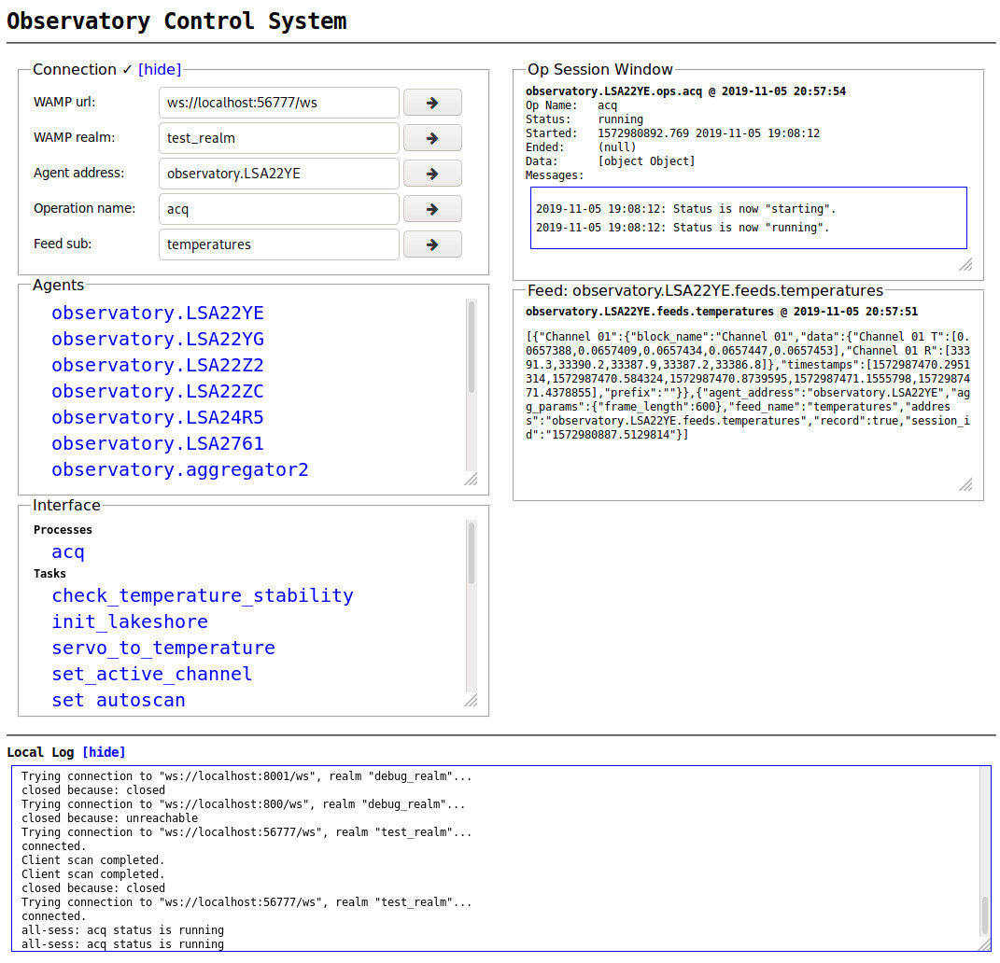

.. highlight:: bash

.. _ocs_web:

=======
OCS Web
=======

Overview
========

OCS Web is the JavaScript web client front end for OCS. Currently it is capable
of monitoring the running OCS agents on a system. It can be used to query the
status of available agent operations and feeds.



Setup
=====

OCS Web is provided via a Docker image. You can add it to your system's
``docker-compose.yml`` file::

  ocs-web:
    image: simonsobs/ocs-web:latest
    volumes:
      - ${OCS_CONFIG_DIR}:/config:ro
    ports:
      - "127.0.0.1:3002:80"

The port you expose to is flexible, here we choose 3002 as an example (avoiding
Grafana on port 3000, and another service on port 3001). You should choose a
port you know is available.

Usage
=====

There are several usage scenarios depending on your setup.

Direct Viewing
``````````````
If you want to view OCS Web on the same device hosting the Docker container you
can simply navigate to `<http://localhost:3002/monitor.html>`_ in your browser. Your
local browser needs access to the crossbar server. This will require the crossbar
server also be exposed locally. This will likely be the case if you're operating
a single node system. If you have a multi-node system you will need to know
your crossbar server's address for entry in the "WAMP url:" field on the OCS
Web monitor page.

Remote Viewing
``````````````
If you want to view OCS Web remotely, say on your laptop, you will need a
web server setup on your system. The recommendation is that this web server proxy
the connection to the provided ocs-web container. In nginx you would add a
block like this to your server configuration::

    location /ocs/ {
      proxy_pass http://localhost:3002/;
    }

This assumes the web server you are running is also on the same host running the
Docker container. If this is not the case you should replace "localhost" here
with the address of the system running OCS Web. You will then be able to access
OCS Web at your domain in the subdirectory "ocs/monitor.html", i.e.
`<http://example.com/ocs/monitor.html>`_

In order for your remote web browser to have access to the crossbar server we
currently recommend ssh tunneling to the machine running your crossbar server.
This can be accomplished with::

    $ ssh -N -L 56777:localhost:8001 <crossbar host>

You would then use the address "ws://localhost:56777/ws" as your "WAMP url", as
shown in the above screenshot. The port 56777 can be any available port on your
remote system.
