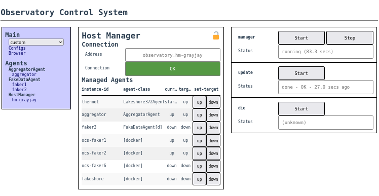

.. _centralized_management:

======================
Centralized Management
======================

Overview
========

In a distributed OCS involving multiple hosts, it is advantageous to
have a way to start and stop Agents without ssh-ing to the various
host systems.

The HostManager Agent, in combination with the ocsbow CLI script or
the HostManager panel in ocs-web, provide this functionality.  When
fully configured, the system provides the following functionality:

- Any OCS Agent in the system can be started and stopped from a single
  client.  This includes support for bringing down all Agents, across
  the system, without having to connect to multiple hosts.
- The OCS Agents running on a particular system will start up
  automatically when the system is booted (even if the Agents are not
  contained in Docker containers).
- The basic health of Agents, across the system, can be monitored and
  individual agents restarted using HostManager panels in ocs-web.

.. warning::

    The HostManager system, once in place, should be the only means by
    which those managed Agents are started or stopped.  For Agents
    running on the native OS, HostManager will run them as child
    processes so that it can monitor their states more easily.  For
    Agents running in docker containers, HostManager takes charge of
    the implicated containers and there will be conflicts if users
    also try to use ``docker compose`` to restart containers.

The main components of this system are:

- :ref:`host_manager` -- an instance of this Agent must be set up for
  each host or docker-ish host in the site_config.yaml file.
- ``systemd`` scripts -- there should be one systemd script (and
  launcher script) set up for each HostManager Agent instance; the
  command-line tool :ref:`ocs-install-systemd` helps with this.
- :ref:`ocsbow` -- the command-line client for communicating with
  HostManager Agents.

Configuration of HostManager Agents
===================================

The HostManager Agents will normally run on the bare systems, rather
than in Docker containers.  This is because they need to start and
stop other processes and start Docker containers on the system.

To enable full centralized control of your system, there must be an
instance of HostManager Agent set up for each host in the Site Config
file (SCF).  Some hosts in the SCF describe agents running in Docker
containers, and normally these are grouped to correspond to a single
docker-compose.yaml file.  Each such host needs a HostManager set up,
though the HostManager runs on the native system and not in a docker
container.

Config for native system hosts
------------------------------

Considering the Example Config from :ref:`ocs_site_config_file`, the
SCF there has 3 hosts defined: ``host-1``, ``host-1-docker``, and
``host-2``.  We must add a HostManager block to the
``'agent-instances'`` list in each case.  For example, the ``host-1``
block would become:

.. code-block:: yaml

    host-1: {

      # Directory for logs.
      'log-dir': '/simonsobs/log/ocs/',

      # Description of host-1's Agents.
      # We have two readout devices; they are both Lakeshore 240. But they can
      # be distinguished, on startup, by a device serial number.
      # We also have a HostManager.

      'agent-instances': [
        {'agent-class': 'Lakeshore240Agent',
         'instance-id': 'thermo1',
         'arguments': [['--serial-number', 'LSA11AA'],
                       ['--mode', 'idle']]},
        {'agent-class': 'Lakeshore240Agent',
         'instance-id': 'thermo2',
         'arguments': [['--serial-number', 'LSA22BB'],
                       ['--mode', 'acq']]},
        {'agent-class': 'HostManager',
         'instance-id': 'hm-host-1'},
        },
      ]
    }

To test the configuration, you can try to launch the HostManager.  In
a fully configured system, this will be done through systemd.  But for
initial setup you can use the ``ocs-local-support`` program.

.. note::
   When you launch HostManager, it will try to start new processes for
   each of its managed Agents!  So you should shut down any running
   instances, and be in a state where it's acceptable to start up new
   instances.

To launch the HostManager agent for the system you're logged into, run::

  $ ocs-local-support start agent --foreground

You can Ctrl-C out of this to kill the agent.  (If you accidentally
run this without the ``--foreground``, you can try using
``ocs-local-support stop agent`` to stop it.)

To start using ocsbow to communicate with this HostManager, see
`Communicating with HostManager Agents`_.  To set the HostManager
up in systemd (useful especially to have the HostManager and managed
agents start up when the system boots), see `systemd Control of
HostManagers`_.

Config for docker pseudo-hosts
------------------------------

Considering the Example Config from :ref:`ocs_site_config_file`, the
host ``host-1-docker`` describes agents that are launched in
containers using ``docker compose``.  For HostManager to best manage
these agents, a HostManager should be described in this same host
config block.  The HostManager won't run in a docker container -- it
will run on the host system.  In this case the HostManager should have
a ``--docker-compose`` argument that specifies the docker-compose.yaml
file (or multiple, comma-separated, files) containing services to
manage.

In addition to adding HostManager, each other agent instance in the
config **must include** the setting ``'manage': 'docker'``.

So the ``host-1-docker`` block in the site config file would
become:

.. code-block:: yaml

  host-1-docker: {

    # Description of host-1's Agents running with Docker containers.
    # We have one readout device; a Lakeshore 372.

    'agent-instances': [
      {'agent-class': 'Lakeshore372Agent',
       'instance-id': 'LSARR00',
       'manage': 'docker',
       'arguments': [['--serial-number', 'LSARR00'],
                     ['--ip-address', '10.10.10.55']]},
      {'agent-class': 'HostManager',
       'instance-id': 'hm-host-1-docker',
       'arguments': [['--initial-state', 'up'],
                     ['--docker-compose', '/home/ocs/site-config/host-1-docker/docker-compose.yaml']]},
    ]
  }

To launch this agent, for testing, you can run::

  $ ocs-local-support start agent --site-host=host-1-docker --foreground

(The ``--site-host`` argument helps ocs-local-support to find the
HostManager config in the host-1-docker block of site config, instead
of the host-1 block.)

.. note::

   The HostManager process must be running as a user with sufficient
   privileges to run ``docker`` and ``docker compose``.  Usually that
   means that the user must be root, or must be in the "docker" user
   group.  The recommendation is that you add the :ref:`OCS user
   <create_ocs_user>` to the docker group (see
   `docker-linux-postinstall`_).

.. _docker-linux-postinstall: https://docs.docker.com/engine/install/linux-postinstall/

In order for HostManager to recognize that services defined in your
docker-compose.yaml correspond to certain agent instance_id values,
make sure the services are called ``ocs-[instance_id]``.  (The choice
of ocs- prefix is configurable with a command-line argument to
HostManager, and can be set to the empty string if you want).  In
ocsbow and ocs-web, agents running in docker containers will show up
with a [d] appended to their usual agent_class name.

If HostManager finds services in the docker-compose.yaml that don't
seem to correspond to agent instances in site config, it will still
permit them to be "managed" (brought up and down).  The agent_class,
in ocsbow or ocs-web, will show up as simply "[docker]".

Advanced host config
~~~~~~~~~~~~~~~~~~~~

The ``manage`` setting in the instance description can be used to
fine-tune the treatment of each Agent instance by HostManager.  For
example, to exclude an instance from HostManager tracking and control,
specify ``'manage': 'ignore'``.  It is also possible to specify that
certain instances should not be started automatically (for example
``"host/down"`` or ``"docker/down"``).  For information on the
available settings for "manage", see the description in
:meth:`ocs.site_config.InstanceConfig.from_dict`.

It is possible to mix host- and docker-based agents in a single host
config block, and control them all with a single HostManager instance.
Just make sure your docker-based agents are marked with ``'manage':
'docker'`` in site config, and have service name ``ocs-[instance-id]``
as usual.  Usually, docker-based agents have some command line
parameter overrides set in docker-compose.yaml (or in the site config
block), because the crossbar address is different or weird from inside
the container.  If the hostname, in the docker container, is not the
same as on the host system then specify the native host hostname with
the ``--site-host`` parameter.  In the usual example, an Agent
instance in a container would see system hostname ``host-1-docker``,
and you'd want to pass ``--site-host=host-1`` so that it finds its
config in the ``host-1`` part of the site config file.

Communicating with HostManager Agents
=====================================

This section describes using the :ref:`ocsbow` command line tool to
communicate with all the HostManager agents in an OCS setup.  A
complementary approach is to use ocs-web; see `Using ocs-web with
HostManager`_.

``ocsbow`` is a special client program that knows how to parse the SCF
and figure out what HostManager are running on the system.  This
allows it to query each one (using standard OCS techniques) and
present the status of all the managed agents.

Like any other OCS client program, ``ocsbow`` needs to be able to find
the site config file.  (If you have just made changes to the SCF to
add HostManager agents, make sure the system you're running this
client on also has access to that updated SCF.)

Inspecting status
-----------------

The basic status display is shown if you run ``ocsbow``.  In the
example above, the output will look something like this::

  $ ocsbow
  ocs status
  ----------

  The site config file is :
    /home/ocs/site-config/default.yaml

  The crossbar base url is :
    http://my-crossbar-server:8001/call

  ---------------------------------------------------------------------------
  Host: host-1

    [instance-id]                  [agent-class]           [state]   [target]
    hm-host-1                      HostManager                  up        n/a
    thermo1                        Lakeshore240Agent            up         up
    thermo2                        Lakeshore240Agent            up         up

  ---------------------------------------------------------------------------
  Host: host-1-docker

    [instance-id]                  [agent-class]           [state]   [target]
    LSARR00                        Lakeshore372Agent[d]         up         up

  ---------------------------------------------------------------------------
  Host: host-2

    [instance-id]                  [agent-class]           [state]   [target]
    thermo3                        Lakeshore240Agent            up         up
    aggregator                     AggregatorAgent              up         up

The output is interpreted as follows.  After an initial statement of
what site config file is being used, and the crossbar access address,
a block is presented for each host in the SCF.  Within each host
block, each agent instance-id is listed, along with its agent-class
and values for "state" and "target".

The agent in host-1-docker has the annotation [d] beside its class
name, indicating this is an agent managed through a docker container.
(The docker service name, in this example, would be ocs-LSARR00.)

If an Agent has been configured with ``'manage': 'ignore'``, it will
be marked with suffix ``[unman]`` and will have question marks in the
state and target fields, e.g.::

    [instance-id]        [agent-class]                     [state]   [target]
    registry             RegistryAgent[unman]                    ?          ?

If the SCF seen by ocsbow and the information in HostManager are not
in agreement, then the agent-class will include two values, connected
with a slash.  For example, if the local SCF expects the instance to
be managed through docker, but the HostManager reports it running on
the host, then the line might look like this::

    [instance-id]        [agent-class]                             [state]   [target]
    LSARR00              Lakeshore372Agent[d]/Lakeshore372Agent         up         up

A managed docker container that has not been associated with a
specific instance will show up with agent-class "?/[docker]" and an
instance-id corresponding to the service name.  For example::

    [instance-id]        [agent-class]                     [state]   [target]
    influxdb             ?/[docker]                             up         up

``state`` and ``target``
~~~~~~~~~~~~~~~~~~~~~~~~

The ``state`` column shows whether the Agent is currently running
(``up``) or not (``down``).  This column may also show the value
``unstable``, which indicates that an Agent keeps restarting (this
usually indicates a code, configuration, or hardware error that is
causing the agent to crash shortly after start-up).  The value may
also be ``?``, indicating that the agent is marked to be run through
Docker, but no corresponding docker service has been identified.

For the non-HostManager agents, the ``target`` column shows the state
that HostManager will try to achieve for that Agent.  So if
``target=up`` then the HostManager will start the Agent, and keep
restarting the Agent if it crashes or otherwise terminates.  If
``target=down`` then the HostManager will stop the Agent and not
restart it.  (Note that in the case of Agents in docker containers,
the HostManager will use docker and docker compose to monitor the
state of containers, and request start or stop in order to match the
target state.)

Each HostManager can be commanded to change the target state of Agents
it controls; see `Start/Stop Agents`_.

For the HostManager lines, the ``target`` will always be ``[n/a]`` and
the state will either be ``up``, ``down``, or ``sleeping``.  When the
HostManager appears to be functioning normally, the state will be
``up``.  If the HostManager appears to not be running at all, the
state will be ``down``.  If the HostManager is running but the
"manage" Process is not running for some reason, the state will be
``sleeping``.

Start/Stop Agents
-----------------

To start an Agent, through its HostManager, run ``ocsbow up``,
specifying the agent-id.  For example::

  $ ocsbow up thermo1

The correct HostManager will be contacted and ``target=up`` will be
set for that Agent instance.  Similarly::

  $ ocsbow down thermo1

will set ``target=down`` for the ``thermo1`` instance.

Start/Stop Batches of Agents
----------------------------

You can pass multiple instance-id targets in a single line, even if
they are managed by different HostManagers.  For example::

  $ ocsbow down thermo1 thermo3

If you pass the instance-id of a *HostManager*, then the target state
will be applied to *all* its managed agents.  So in our example::

  $ ocsbow down hm-host-1

is equivalent to::

  $ ocsbow down thermo1 thermo2

You can target *all* the managed agents in a system using the ``-a``
(``--all``) switch::

  $ ocsbow down -a    # Bring down all the agents!
  $ ocsbow up -a      # Bring up all the agents!

Note that none of these commands will cause the HostManager agents to
stop.  Restarting HostManagers must be done through another means (the
systemd controls, or ``ocs-local-support``).

systemd Control of HostManagers
===============================

`systemd`_ is widely used on Linux systems to manage services and
daemons (and lots of other stuff).  The OCS program
:ref:`ocs-install-systemd` may be used to help register each
HostManager Agent as a systemd service.  The `systemctl`_ program
(part of systemd) can then be used to start and stop the Agent, or to
configure it to start automatically on system boot.

.. note::

   Before bothering with systemd, you must already have ocs installed
   on the host in question, with the site config specified for this
   host and a HostManager instance properly configured to control
   agents on the system.

.. _`systemd`: https://systemd.io/
.. _`systemctl`: https://man7.org/linux/man-pages/man1/systemctl.1.html

Configuring the systemd service
-------------------------------

The service configuration consists of two files, which are described
in more detail a little later:

- The *.service file*
- The *launcher script*

To generate those files, run::

  $ hostname
  ocs-host5
  $ cd $OCS_CONFIG_DIR
  $ ocs-install-systemd --service-dir=.
  Writing /home/ocs/ocs-site-configs/my-ocs/launcher-hostmanager-ocs-host5.sh ...
  Writing ./ocs-hostmanager.service ...

After generating the .service file, copy it to the systemd folder::

  $ sudo cp ocs-hostmanager.service /etc/systemd/system/

At this point you should be able to check the "status" of the
service::

  $ sudo systemctl status ocs-hostmanager.service

It probably won't say very much.  If you've updated the service file
recently (i.e. reinstalled it, with or without changes), it might
recommend that you run ``systemctl daemon-reload``; you should
probably do so.

At this point you might want to jump to :ref:`controlling_systemd`.
Some additional details about the service file and launcher script are
provided here.

One Host, Many Managers
~~~~~~~~~~~~~~~~~~~~~~~

If you need to run two or more HostManagers on one system, you
probably also want to have multiple services set up.  (This might be
the case if you're using multiple docker-compose.yaml, or if you have
both docker and native system agents running.).

Use arguments ``--site-host`` and ``--service-host`` to identify which
HostManager you mean, and give the services different names::

  $ ocs-install-systemd --service-dir=. --service-host=host-1 --site-host=host-1
  Writing /home/ocs/ocs-site-configs/my-ocs/launcher-hm-host-1.sh ...
  Writing ./ocs-hostmanager-host-1.service ...

  $ ocs-install-systemd --service-dir=. --service-host=host-1-docker --site-host=host-1-docker
  Writing /home/ocs/ocs-site-configs/my-ocs/launcher-hm-host-1-docker.sh ...
  Writing ./ocs-hostmanager-host-1-docker.service ...

The ``--site-host`` argument helps the code find the instance_id of
the HostManager in the SCF, and to name the launcher script.  The
``--service-host`` argument is used simply to give the .service file a
different filename.

The .service file
~~~~~~~~~~~~~~~~~

The .service file is a `service configuration file`_ for systemd, and
there are lots of things that could be set up in there.  The file
created by :ref:`ocs-install-systemd` is minimal, but sufficient.  It
should look something like this::

  [Unit]
  Description=OCS HostManager for server5

  [Service]
  ExecStart=/home/ocs/git/ocs-site-configs/my-lab/launcher-hm-server5.sh
  User=ocs
  Restart=always
  RestartSec=10s

  [Install]
  WantedBy=multi-user.target

This can be edited further before (or after) it is installed.  You can
control the hostname (server5 here) and system user (ocs here) that
get dropped into the template with the ``--service-host`` and
``--service-user`` arguments to ``ocs-install-systemd``... or just
edit them by hand.

If you want to keep copies of the service file in version control, be
aware that it might make sense to call the installed service file
``ocs-hostmanager.service``, on each system, but you will need
different filenames (probably ``ocs-hostmanager-<hostname>.service``)
in your site config dir.

.. _`service configuration file`: https://www.freedesktop.org/software/systemd/man/systemd.service.html

The launcher script
~~~~~~~~~~~~~~~~~~~

The launcher script is a bash script that runs HostManager.  It is
called by systemd when starting the service.  Any environment
variables or additional command line arguments that need to be set for
the HostManager instance can be set in this script.  The script should
normally be kept with other OCS configuration files, such as the
SCF.

The launcher script is probably not needed, because a lot of
additional configuration (such as environment variables) can be put
into a .service file.  But in the interest of familiarity, the default
behavior provides users with the launcher script.

.. _controlling_systemd:

Controlling the systemd service
-------------------------------

The usual systemctl commands (start, stop, restart, enable, disable)
are used to control the service.

**Starting and stopping the service:**

Use the usual systemctl commands to start ...::

  $ sudo systemctl start ocs-hostmanager.service

... or to stop the service::

  $ sudo systemctl stop ocs-hostmanager.service

**Checking status**

The status of the service (including whether it is running, whether it
is enabled, and a few lines from the logs) can be obtained from the
"status" command to systemctl::

  $ sudo systemctl status ocs-hostmanager.service

**Controlling startup on boot**

The systemd terminology for "will be launched when system boots" is
"enabled".  To enable launch-on-boot::

  $ sudo systemctl enable ocs-hostmanager.service

To disable launch-on-boot::

  $ sudo systemctl disable ocs-hostmanager.service

Using ocs-web with HostManager
==============================

The ocs-web system includes a Panel for HostManager agents.  Here's a
screenshot of what that looks like:

In its current form, the control panel is associated with a single
HostManager, and there is no way to broadcast target state requests to
multiple targets.
