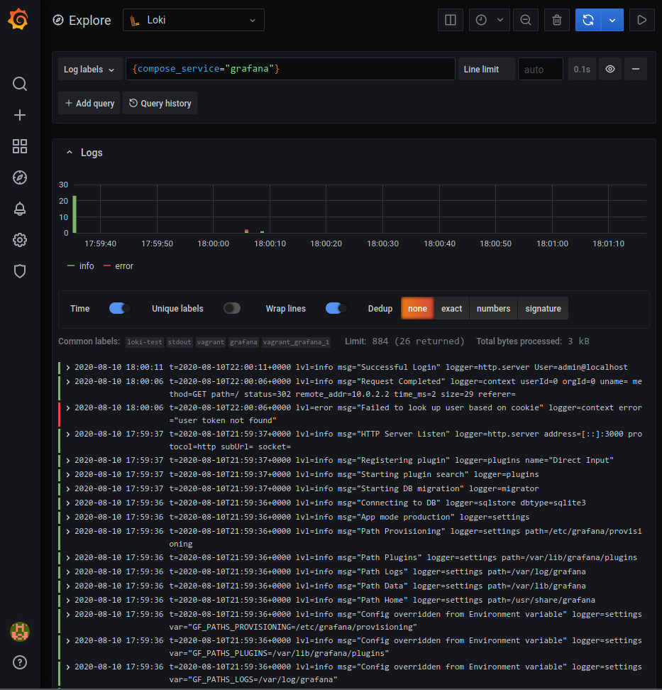

.. _logging:

Log Aggregation
===============

Since the recommended method for deploying OCS is within Docker containers, the
logs for each Agent end up in the configured logging system for Docker. By
default this is a json-file format, however Docker supports several other
`logging drivers`_ including syslog and journald. Users are free to integrate
the Docker logs into their own log aggregation system.

If you do not already have a log aggregation system, we recommend the use of
`Loki`_, a log aggregation system from the makers of Grafana. Loki integrates
nicely with Grafana and provides a central place to view timestreams from OCS
and logs from the Agents.

.. _logging drivers: https://docs.docker.com/config/containers/logging/configure/
.. _Loki: https://grafana.com/oss/loki/

Installing Loki
---------------
Grafana Labs provides a Docker logging driver plugin for Loki, which makes
configuring log forwarding to Loki very simple. Install the plugin with::

    $ docker plugin install grafana/loki-docker-driver:latest --alias loki --grant-all-permissions

You should then see the plugin installed::

    $ sudo docker plugin ls
    ID                  NAME                DESCRIPTION           ENABLED
    420af51d8773        loki:latest         Loki Logging Driver   true

Now that we have the plugin installed we need to start the Loki service. This
can be done several ways, however we recommend using Docker or Docker Compose.
For more installation methods, see the `Loki installation documentation`_. To
use Docker Compose a separate docker-compose.yml file allows you to keep the
service running all the time even if you bring down your OCS containers. An
example Compose file looks like::

    version: '3.7'
    volumes:
      loki-storage:
    
    x-log-options:
      &log-options
      logging:
        driver: loki
        options:
          loki-url: "http://localhost:3100/loki/api/v1/push"
    
    services:
      loki:
        image: grafana/loki:1.5.0
        <<: *log-options
        container_name: "loki"
        restart: always
        ports:
          - "3100:3100"
        volumes:
          - loki-storage:/loki
        command: -config.file=/etc/loki/local-config.yaml
    
    networks:
      default:
        external:
          name: ocs-net

.. note::
    Version 1.5.0 was the latest at the time of this writing, but there may be
    more recent versions available. You can check on the grafana/loki Docker
    Hub page.

You will notice the ``log-options`` YAML alias. This refers back to the
log-options anchor. You will need to add the ``log-options`` alias to any
service which you would like to forward their logs to Loki.

.. note::
    The ``loki-url`` here must match the address of the node you are running
    the grafana/loki container on. In this case that is ``localhost``, but if you
    have a multi-node configuration this could be a different IP address.

The plugin can also be enabled for all containers on the system by configuring
the logging driver in the Docker daemon configuration. For more details see the
`Loki Docker driver documentation`_.

.. note::
    Once the loki logging driver is installed and configured access to logs
    should still be accessible via ``docker logs``, however it is no longer
    available via ``docker-compose logs``. You will instead see a warning::

        WARNING: no logs are available with the 'loki' log driver

.. _Loki installation documentation: https://grafana.com/docs/loki/latest/installation/
.. _Loki Docker driver documentation: https://grafana.com/docs/loki/latest/clients/docker-driver/configuration/

Configuration
-------------
Once you have a Loki container running and some Docker containers setup to
forward their logs to Loki we can begin to explore the logs in Grafana. To
start, we must add a new Loki data source. This is similar to setting up the
InfluxDB data source. A screenshot of the configuration is shown here:

The URL configured should match the name of your Loki service and the
configured port. The screenshot here follows the above example.

Once configured you can either use the "Logs" visualization when adding a panel
to your Grafana dashboards, or view your logs in the "Explore" menu, which has
the nice feature of showing log message frequency over time. Logs can be
selected by compose service, compose project, container name and more. The
below screenshot shows the Explore menu viewing the "grafana" compose service,
showing us our Grafana Docker container logs.

