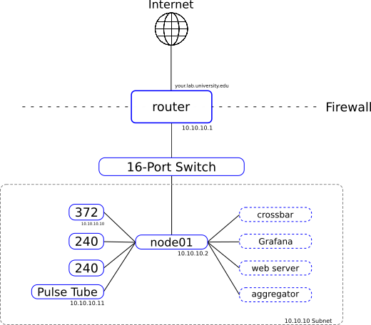
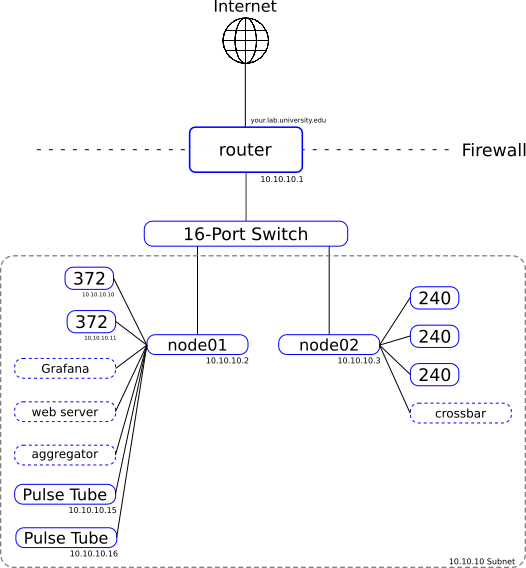

.. _network:

=====================
Network Configuration
=====================

The Observatory Control System and associated live monitoring tools were
designed to be modular, providing a flexible framework upon which to build
an observatory's network. This freedom enables the distributed, scalable
architecture needed for future generations of observatories, but requires some
thought be put in to network design before deployment, be this in a test lab or
on site.

This page describes some possible network configurations and how to configure
them. These, at the moment, mostly focus on testing in the lab, but the more
advanced examples should eventually apply to the site.

While these examples describe possible configurations, other configurations may
be possible, and in some cases even required depending on the limitations
placed by a given environment. Labs at Universities are encouraged to work with
their local IT departments when needed.

Single-Node Configuration
-------------------------
Perhaps the simplest example configuration is that which contains a single
compute node which runs all OCS Agents and associated supporting software (i.e.
crossbar, Grafana, a web server, InfluxDB, etc.) In this instance, all required
hardware communicates with this single node (node01) over a local network. This
configuration is common in small setups found in test labs.



Addressed blocks in the subnet of this diagram represent networked hardware
such as the Lakeshore 372 or Pulse Tube compressor. Solid blocks without a
network address represent USB connected devices, and dashed boxes represent a
selection of the containers running on the node. This example shows a subset of
the possible running processes in a single-node setup. Note, networked devices
are connected via the switch, lines here are meant to illustrate what devices
are interfaced with software running on ``node01``.

Single-Configuration File
`````````````````````````
On a single node system one might configure all desired containers in
a single `docker-compose.yml` file, this allows for easy networking/name
resolution among containers, as they all communicate over a single Docker
bridge network (managed by Docker Compose).

Name resolution works well within isolated Docker environments, however, when
we need to communicate with another device on the network outside of our single
compute node we need to put containers performing this communication into the
"host" network mode by adding the following line to the service block for the
given container::

    network_mode: "host"

This puts the container on the host network, allowing it to reach the networked
hardware.

.. note::
    Keep in mind that this disables the convenient name resolution
    provided by the Docker network, so your container will likely require
    additional configuration, particularly if it needs to also communicate with the
    crossbar server.

.. _multiconfig:

Multiple-Configuration Files
````````````````````````````
A single configuration file might be simple, however, for some containers it
might make sense to separate them to a separate `docker-compose.yml` file in
order to make restarting OCS components without interrupting services such as
the web server or InfluxDB. In this case we will want to create a user defined
Docker network::

    user@node01:~$ docker network create --driver bridge ${NETWORK}

Here you can name the network whatever you would like. We will use "ocs-net" in
the example below.

.. note::
    If you are going to eventually setup a multi-node configuration you might
    want to skip to that section of the documentation and create an "overlay"
    network instead. It will function similar to this bridge network, but also
    allow communication with other nodes.

Once you have created the bridge network, in each of your
``docker-compose.yml`` files add this networks block at the top level::

    networks:
      default:
        external:
          name: ocs-net

After restarting your various docker-compose services containers that are split
among multiple compose files should now be able to communicate using the names
given to each service within each compose file, i.e. all services should be
able to resolve "crossbar" instead of requiring an explicit IP address for the
crossbar server.

The Docker documentation contains more information about `Networking in Compose
<https://docs.docker.com/compose/networking/>`_.

Multi-Node Configuration
------------------------
Once hardware that requires additional compute nodes, such as a SMuRF crate or
Bluefors system, is added to a network it often makes sense to configure a
multi-node network.



Addressed blocks in the subnet of this diagram represent networked hardware
such as the Lakeshore 372 or Pulse Tube compressor. Solid blocks without a
network address represent USB connected devices (Lakeshore 240), and dashed
boxes represent a selection of the containers running on the node. Note,
networked devices are connected via the switch, lines here are meant to
illustrate what devices are interfaced with software running on ``node01``.

To accomplish this we use Docker's `overlay networking
<https://docs.docker.com/network/overlay/>`_. This is a feature used by Docker
Swarm to distribute containers across multiple nodes for container
orchestration and scaling. While we do not use swarm, the networking
functionality is useful.

.. note::
    Once configured you may regularly see a warning like this::

        WARNING: The Docker Engine you're using is running in swarm mode.

        Compose does not use swarm mode to deploy services to multiple nodes in
        a swarm. All containers are scheduled on the current node.

        To deploy your application across the swarm, use `docker stack deploy`.

    This is normal, and can be safely ignored.

To start, pick one of your compute nodes to be the swarm "manager". We will use
``node01`` in our example. On ``node01`` run::

    user@node01:~$ docker swarm init
    Swarm initialized: current node (vz1mm9am11qcmo979tlrlox42) is now a manager.

    To add a worker to this swarm, run the following command:

        docker swarm join --token SWMTKN-1-5g90q48weqrtqryq4kj6ow0e8xm9wmv9o6vgqc5j320ymybd5c-8ex8j0bc40s6hgvy5ui5gl4gy 172.31.47.252:2377

    To add a manager to this swarm, run 'docker swarm join-token manager' and follow the instructions.

This initializes the swarm. On your other nodes (we'll stick to one other node,
``node02``, for the example) run the command given above to join::

    user@node02:~$ docker swarm join --token <your_token> <your_ip_address>:2377
    This node joined a swarm as a worker.

.. note::
    If you have a firewall in place, such as ``ufw``, then you will need to
    open ports 2377, 7946, and 4789 to any node you would like to join to the
    swarm.

This joins ``node02`` to the swarm managed by ``node01``, however, this does not
establish the overlay network yet. If you look at your available networks you
will likely see something like::

    user@node01:~$ docker network ls
    NETWORK ID          NAME                DRIVER              SCOPE
    82aaeabc9590        bridge              bridge              local
    e30cc6864065        docker_gwbridge     bridge              local
    62889a26aef5        host                host                local
    0cxoqi2vy1m7        ingress             overlay             swarm
    57a043746a98        none                null                local

Create an attachable overlay network::

    user@node01:~$ docker network create --driver=overlay --attachable ocs-net
    u81efzewueadmb4v4act6b4yi

.. note::
    If you have followed the single-node configuration above you will already
    have a network named ``ocs-net``. You will either want to remove that network,
    or name your overlay network differently.

You should see the new network in your network list::

    user@node01:~$ docker network ls
    NETWORK ID          NAME                DRIVER              SCOPE
    82aaeabc9590        bridge              bridge              local
    e30cc6864065        docker_gwbridge     bridge              local
    62889a26aef5        host                host                local
    0cxoqi2vy1m7        ingress             overlay             swarm
    57a043746a98        none                null                local
    u81efzewuead        ocs-net             overlay             swarm

However, ``node02`` will not see the overlay network until a container running
on ``node02`` attaches to it::

    user@node02:~$ docker network ls
    NETWORK ID          NAME                DRIVER              SCOPE
    a671a66b3c2f        bridge              bridge              local
    abf9d7b8a064        docker_gwbridge     bridge              local
    806f30c202a3        host                host                local
    0cxoqi2vy1m7        ingress             overlay             swarm
    901da55ebaab        none                null                local

Create a small, background, always-on container to establish a permanent
network connection::

    user@node02:~$ docker run -dit --name overlay-background --restart always --network ocs-net alpine

You should see the container running::

    user@node02:~$ docker ps
    CONTAINER ID        IMAGE               COMMAND             CREATED             STATUS              PORTS               NAMES
    0436ebd58b3b        alpine              "/bin/sh"           4 seconds ago       Up 1 second                             overlay-background

Once the container is running you should now see the overlay network on ``node02``::

    user@node02:~$ docker network ls
    NETWORK ID          NAME                DRIVER              SCOPE
    a671a66b3c2f        bridge              bridge              local
    abf9d7b8a064        docker_gwbridge     bridge              local
    806f30c202a3        host                host                local
    0cxoqi2vy1m7        ingress             overlay             swarm
    901da55ebaab        none                null                local
    u81efzewuead        ocs-net             overlay             swarm

You can now add a networks block to each compose file on each node attached to
the overlay network like we did for the multi-configuration file example above
to attach each service in your compose files to the ``ocs-net`` network. This
will allow name resolution based on service name across nodes.

Repeat these steps on each additional node you would like to add to the
network.

Containers that require communication with networked devices not running Docker
(i.e. networked hardware devices such as the Lakeshore 372) will still need to
be in the "host" network mode.

This guide essentially followed along with the Docker documentation for `using
an overlay network for standalone containers
<https://docs.docker.com/network/network-tutorial-overlay/#use-an-overlay-network-for-standalone-containers>`_.
