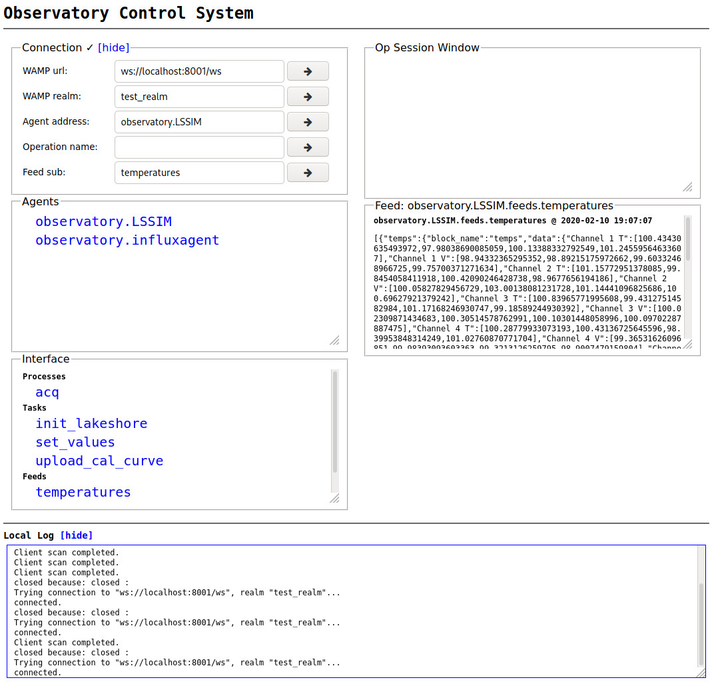

.. _quickstart:

Quickstart
==========

We will assume you have already gone through the :ref:`installation` part of the
documentation and thus have installed the required dependencies, namely Docker,
Docker Compose, and ocs.

In this example we will generate a crossbar server configuration, run a single
OCS Agent (the Lakeshore 240 Agent) and an associated hardware simulator, pass
the data to an InfluxDB, and view the data in Grafana.

Configuration Files
-------------------
Before we begin we need to setup the configuration files. Let's first create a
directory to keep all of our site configuration files in (we'll use the
`dot_crossbar` sub-directory soon)::

    $ mkdir -p ocs-site-configs/dot_crossbar/
    $ cd ocs-site-configs/

Next we need to write our two configuration files, first the OCS site config
file, use this file, unchanged.

**default.yaml**::

    # Site configuration for a fake observatory.
    hub:
    
      wamp_server: ws://sisock-crossbar:8001/ws
      wamp_http: http://sisock-crossbar:8001/call
      wamp_realm: test_realm
      address_root: observatory
      registry_address: observatory.registry
    
    hosts:
    
      localhost: {
      'crossbar': {'config-dir': './dot_crossbar/'},
        'agent-instances': [
          {'agent-class': 'HostMaster',
           'instance-id': 'master-host-1',
           'arguments': []},
        ]   
      }
    
      ocs-docker: {
    
        # Quick start example Agents
    
        'agent-instances': [
          {'agent-class': 'InfluxDBAgent',
           'instance-id': 'influxagent',
           'arguments': [['--initial-state', 'record']]},
          {'agent-class': 'Lakeshore240Agent',
           'instance-id': 'LSSIM',
           'arguments': [['--serial-number', 'LSSIM'],
                         ['--port', 'tcp://ls240-sim:1094'],
                         ['--mode', 'acq']]},
        ]   
      }

Next, we need to define the Docker Compose file. Again, use this file unchanged.

**docker-compose.yaml**::

    version: '2' 
    services:
      # --------------------------------------------------------------------------
      # Grafana for the live monitor.
      # --------------------------------------------------------------------------
      grafana:
        image: grafana/grafana:6.5.0
        ports:
          - "127.0.0.1:3000:3000"
    
      # InfluxDB Backend for Grafana
      influxdb:
        image: influxdb:1.7
        container_name: "influxdb"
        restart: always
        ports:
          - "8086:8086"
    
      # --------------------------------------------------------------------------
      # Crossbar Server
      # --------------------------------------------------------------------------
      sisock-crossbar:
        image: simonsobs/sisock-crossbar:latest
        ports:
          - "127.0.0.1:8001:8001" # expose for OCS
        volumes:
          - ./dot_crossbar:/app/.crossbar
        environment:
             - PYTHONUNBUFFERED=1
    
      # --------------------------------------------------------------------------
      # OCS Components
      # --------------------------------------------------------------------------

      # OCS Web
      ocs-web:
        image: simonsobs/ocs-web:latest
        volumes:
          - ./:/config:ro
        ports:
          - "127.0.0.1:3002:80"

      # LS240 Simulator
      ls240-sim:
        image: simonsobs/ocs-lakeshore240-simulator:latest
        hostname: ocs-docker
    
      # LS240 OCS Agent for Simulator Interaction
      ocs-LSSIM:
        image: simonsobs/ocs-lakeshore240-agent:latest
        hostname: ocs-docker
        depends_on:
          - "sisock-crossbar"
        environment:
          - LOGLEVEL=debug
        volumes:
          - ./:/config:ro
        command:
          - "--instance-id=LSSIM"
          - "--site-hub=ws://sisock-crossbar:8001/ws"
          - "--site-http=http://sisock-crossbar:8001/call"

      # InfluxDB Publisher 
      ocs-influx-publisher:
        image: simonsobs/ocs-influxdb-publisher-agent:latest
        hostname: ocs-docker
        volumes:
          - ./:/config:ro
    
      # Client for fully containerized interactions
      ocs-client:
        image: simonsobs/socs:latest
        depends_on:
          - "sisock-crossbar"
        stdin_open: true
        tty: true
        hostname: ocs-docker
        volumes:
          - ./:/config:ro
          - "./clients:/clients"
        environment:
          - OCS_CONFIG_DIR=/config
        working_dir: /clients

Lastly, we need to generate our crossbar configuration file. ``ocsbow`` can be
used to generate the configuration file, first we will set our
``OCS_CONFIG_DIR`` environment variable, then generate the config::

    $ export OCS_CONFIG_DIR=`pwd`
    $ ocsbow crossbar generate_config
    The crossbar config-dir is set to:
      ./dot_crossbar/
    Using
      ./dot_crossbar/config.json
    as the target output file.
    
    Generating crossbar config text.
    Wrote ./dot_crossbar/config.json

You should now see a crossbar config file in ``./dot_crossbar/``.

.. warning::
    This bare configuration does not consider persistent storage. Any
    configuration done within the containers will be lost on shutdown.

Running
-------

Now that the system is configured, we can start it with a single
``docker-compose`` command::

    $ sudo docker-compose up -d
    Creating network "self-contained-quickstart_default" with the default driver
    Creating self-contained-quickstart_ocs-influx-publisher_1 ... done
    Creating self-contained-quickstart_grafana_1              ... done
    Creating self-contained-quickstart_ls240-sim_1            ... done
    Creating influxdb                                         ... done
    Creating self-contained-quickstart_sisock-crossbar_1      ... done
    Creating self-contained-quickstart_ocs-LSSIM_1            ... done
    Creating self-contained-quickstart_ocs-client_1           ... done

.. note::
    If this is the first time you have run the example, you will see Docker
    Compose "pulling" (downloading) all the required images from DockerHub.

You can view the running containers with::

    $ sudo docker ps
    CONTAINER ID        IMAGE                                           COMMAND                  CREATED             STATUS              PORTS                      NAMES
    73139432daa3        simonsobs/ocs-web:latest                        "nginx -g 'daemon of…"   5 minutes ago       Up 5 minutes        127.0.0.1:3002->80/tcp     self-contained-quickstart_ocs-web_1
    41e4eb3529f5        simonsobs/socs:latest                           "/bin/bash"              11 minutes ago      Up 11 minutes                                  self-contained-quickstart_ocs-client_1
    15d785830335        simonsobs/ocs-lakeshore240-agent:latest         "python3 -u LS240_ag…"   11 minutes ago      Up 11 minutes                                  self-contained-quickstart_ocs-LSSIM_1
    48ea293ab900        influxdb:1.7                                    "/entrypoint.sh infl…"   11 minutes ago      Up 11 minutes       0.0.0.0:8086->8086/tcp     influxdb
    cff53a069dd5        simonsobs/sisock-crossbar:latest                "crossbar start"         11 minutes ago      Up 11 minutes       127.0.0.1:8001->8001/tcp   self-contained-quickstart_sisock-crossbar_1
    807d27607f40        simonsobs/ocs-lakeshore240-simulator:latest     "python3 -u ls240_si…"   11 minutes ago      Up 11 minutes                                  self-contained-quickstart_ls240-sim_1
    e1574571de93        simonsobs/ocs-influxdb-publisher-agent:latest   "python3 -u influxdb…"   11 minutes ago      Up 11 minutes                                  self-contained-quickstart_ocs-influx-publisher_1
    f92628c36f58        grafana/grafana:6.5.0                           "/run.sh"                11 minutes ago      Up 11 minutes       127.0.0.1:3000->3000/tcp   self-contained-quickstart_grafana_1

If anything has gone wrong and some containers have not started, you can view
all containers, even stopped ones with::

    $ sudo docker container ls -a

Viewing
-------
Now that all of the containers are running we have two ways to view what's
going on. First, we have OCS Web, which allows us to see the running Agents. To
view, point your web browser to `<http://localhost:3002/monitor.html>`_. You
should be able to see something like:

Second, we can view the random data being automatically generated by the
Lakeshore240 Simulator in Grafana. You can access Grafana by pointing your web
browswer to `<http://localhost:3000/>`_. For information about how to configure
the InfluxDB data source please see :ref:`influxdb_publisher`. Following that
page you should be able to view a live datastream from the LS240 Simulator.

.. note::
    The default Grafana credentials are "admin"/"admin".

Next Steps
----------
From here the possibilities are endless. You can add additional Agents for more
hardware, viewing their datastreams in Grafana/OCS Web, write a Client to
interact with the running Agents, or develop your own Agent to control any
unsupported hardware.

Shutdown
--------
If you'd just like to shutdown the example you can run::

    $ sudo docker-compose down

This will shutdown and remove all the containers.

.. warning::
    Any configuration made within the containers will be lost when they are
    removed.

If you would also like to remove any Docker images you may have downloaded you
can identify them with::

    $ sudo docker image ls

And remove them with::

    $ sudo docker image rm <image name>
